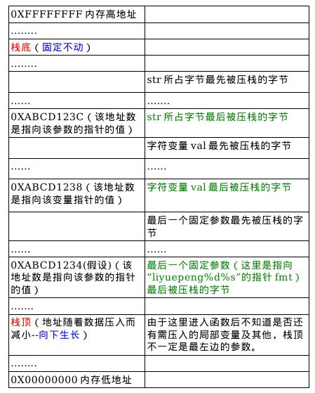

## [变长参数](http://blog.csdn.net/astrotycoon/article/details/8284501)
熟悉C的人都知道，C语言支持[可变参长数函数(Variable Argument Functions)](http://blog.csdn.net/arong1234/article/details/2456455)，即参数的个数可以是不定个，在函数定义的时候用(...)表示，比如我们常用的printf()\execl()函数等；printf函数的原型如下：
```C
int printf(const char *format, ...);  ```
注意，采用这种形式定义的可变参数函数，**至少需要一个普通的形参**，比如上面代码中的*format，后面的省略号是函数原型的一部分。

C语言定义了一系列宏来完成可变参数函数参数的读取和使用：宏va_start、va_arg和va_end；在ANSI C标准下，这些宏定义在stdarg.h中。三个宏的原型如下：
```C
void va_start(va_list ap, last);// 取第一个可变参数（如上述printf中的i）的指针给ap，  
                // last是函数声明中的最后一个固定参数（比如printf函数原型中的*fromat）；  
type va_arg(va_list ap, type);  // 返回当前ap指向的可变参数的值，然后ap指向下一个可变参数；  
                // type表示当前可变参数的类型（支持的类型位int和double）；  
void va_end(va_list ap);    // 将ap置为NULL  ```
当一个函数被定义为可变参数函数时，**其函数体内首先要定义一个va_list的结构体类型**，这里沿用原型中的名字，ap。va_start使ap指向第一个可选参数。va_arg返回参数列中的当前参数并使ap指向参数列表中的下一个参数。va_end把ap指针清为NULL。函数体内可以多次遍历这些参数，但是都必须以va_start开始，并以va_end结尾。

简单的说，我们用va_arg(ap,type)取出一个参数的时候，
```C
type绝对不能为以下类型：
——char、signed char、unsigned char
——short、unsigned short
——signed short、short int、signed short int、unsigned short int
——float

一个简单的理由是：
——调用者绝对不会向my_printf传递以上类型的实际参数。```

在C语言中，调用一个不带原型声明的函数时：调用者会对每个参数执行“默认实际参数提升(default argument promotions)。

同时，对可变长参数列表超出最后一个有类型声明的形式参数之后的每一个实际参数，也将执行上述提升工作。

提升工作如下：
* 
——float类型的实际参数将提升到double
* 
——char、short和相应的signed、unsigned类型的实际参数提升到int
* 
——如果int不能存储原值，则提升到unsigned int

##应用 printf
```C
int printf(const char *format, ...);```
注意，采用这种形式定义的可变参数函数，至少需要一个普通的形参，比如上面代码中的*format，后面的省略号是函数原型的一部分。

C语言之所以可以支持可变参数函数，一个重要的原因是C调用规范中规定C语言函数调用时，参数是从右向左压入栈的；这样一个函数实现的时候，就无需关心调用他的函数会传递几个参数过来，而只要关心自己用到几个；以printf为例：

#### char *str = "fdjsalk"; printf("%d%s\n",val,str);
printf函数在定义的时候，不知道函数调用的时候会传递几个参数。在实现上，printf函数只需关心第一个参数，即字符串“%d%s\n”，当读到%d的时候，printf知道自己需要第二个参数，这时只需要去栈上寻找即可；当读到%s时，再去栈上网上寻找一个参数即可。简单说，printf不关心栈上到底压了多少参数，只关心自己需要多少。


[返回目录](README.md)