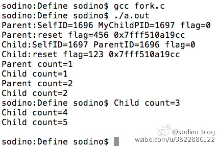

**fork：进程克隆**。一个进程调用fork方法后，系统将根据当前进程的相关参数创建一个几乎完全相同的进程；整个父进程空间会原模原样地复制到子进程中，包括**指令，变量值，程序调用栈，环境变量，缓冲区，等等**。

**process：进程**，是操作系统管理应用运行的基本单位。

**thread：线程**，依附于进程存在。一个进程至少有一个线程，这个线程叫主线程，除此之外，一个进程还可以拥有多个线程，具体的线程多少由线程自行定义。线程存在的价值之一是提供并行处理、异步处理等。把进程比作一个单位的办公室的话，线程就是这个办公室提供服务的窗口。

**signal：**信号或信号量。主要用在数据的同步操作，特别是对于临界资源的管理。换句话说，信号量是保证一个资源的同步使用，避免发生冲突。比如银行处理业务的叫号系统，当有多个服务窗口叫号的时候，信号量就能保证每个窗口叫的号是不同的，从而避免了冲突。
## 进程结构
　　Linux下一个进程在内存里有三部分的数据，就是”代码段”、”堆栈段”和”数据段”。接触过汇编语言的人了解，一般的CPU都有上述三种段寄存器，以方便操作系统的运行。这三个部分也是构成一个完整的执行序列的必要的部分。

　　“代码段”，顾名思义，就是存放了程序代码的数据，如果机器中有数个进程运行相同的一个程序，那么它们就可以使用相同的代码段。”堆栈段”存放的就是子程序的返回地址、子程序的参数以及程序的局部变量。而数据段则存放程序的全局变量，常数以及动态数据分配的数据空间（比如用malloc之类的函数取得的空间）。这其中有许多细节问题，这里限于篇幅就不多介绍了。系统如果同时运行数个相同的程序，它们之间就不能使用同一个堆栈段和数据段。

　　有两个基本的操作用于创建和修改进程：函数fork()用来创建一个新的进程，该进程几乎是当前进程的一个完全拷贝，利用了父进程的代码段、堆栈段、数据段，当父子进程中对共有的数据段进行重新设值或调用不同方法时，才会导致数据段及堆栈段的不同；函数exec()用来启动另外的进程以取代当前运行的进程，除了PID仍是原来的值外，代码段、堆栈段、数据段已经完全被改写了。 　　

###创建进程


可以看到 do_fork 是进程创建的基础。可以在 ./linux/kernel/fork.c 内找到 do_fork 函数（以及合作函数 copy_process）。

**do_fork 函数首先分配一个新的PID，然后调用copy_process：**调用 alloc_pidmap，该调用会分配一个新的 PID。接下来，do_fork 检查调试器是否在跟踪父进程。如果是，在 clone_flags 内设置 CLONE_PTRACE 标志以做好执行 fork 操作的准备。之后 do_fork 函数还会调用 copy_process，向其传递这些标志、堆栈、注册表、父进程以及最新分配的 PID。

新的进程在** copy_process 函数内作为父进程的一个副本创建**。此函数能执行除启动进程之外的所有操作，启动进程在之后进行处理。copy_process 内的第一步是验证 CLONE 标志以确保这些标志是一致的。如果不一致，就会返回 EINVAL 错误。接下来，询问 Linux Security Module (LSM) 看当前任务是否可以创建一个新任务。要了解有关 LSM 在 Security-Enhanced Linux (SELinux) 上下文中的更多信息，请参见 参考资料 小节。

接下来，**调用 dup_task_struct 函数（在 ./linux/kernel/fork.c 内），这会分配一个新 task_struct** 并将当前进程的描述符复制到其内。在新的线程堆栈设置好后，一些状态信息也会被初始化，并且会将控制返回给 copy_process。

控制回到 copy_process 后，除了其他几个限制和安全检查之外，还会执行一些常规管理，包括在**新 task_struct 上的各种初始化**。之后，会调用一系列复制函数来复制此进程的各个方面，比如复制开放文件描述符（copy_files）、复制符号信息（copy_sighand 和 copy_signal）、复制进程内存（copy_mm）以及最终复制线程（copy_thread）。

之后，这个新任务会被指定给一个处理程序，同时对允许执行进程的处理程序进行额外的检查（cpus_allowed）。新进程的优先级从父进程的优先级继承后，执行一小部分额外的常规管理，而且**控制也会被返回给 do_fork**。在此时，新进程存在但尚未运行。do_fork 函数通过调用 wake_up_new_task 来修复此问题。此函数（可在 ./linux/kernel/sched.c 内找到）初始化某些调度程序的常规管理信息，将**新进程放置在运行队列之内**，然后将其唤醒以便执行。最后，一旦返回至 do_fork，此 PID 值即被返回给调用程序，进程完成。

###销毁进程


do_exit 的目的是将所有对当前进程的引用从操作系统删除（针对所有没有共享的资源）。销毁的过程先要通过**设置 PF_EXITING 标志来表明进程正在退出**。内核的其他方面会利用它来避免在进程被删除时还试图处理此进程。将进程从它在其生命期间获得的各种资源分离开来是通过一系列调用实现的，比如 exit_mm（删除内存页）和 exit_keys（释放线程会话和进程安全键）。do_exit 函数执行**释放进程所需资源**的各种统计，这之后，通过调用 exit_notify **执行一系列通知**（比如，告知父进程其子进程正在退出）。最后，进程状态被更改为 PF_DEAD，并且还会调用 schedule 函数来选择一个将要执行的新进程。请注意，如果对父进程的通知是必需的（或进程正在被跟踪），那么任务将不会彻底消失。如果无需任何通知，就可以调用 release_task 来实际收回由进程使用的那部分内存。

### fork()函数

```C
    #include <unistd.h>
    pid_t fork(void);```
    
　　当执行fork()函数后，会生成一个子进程，**子进程的执行从fork()的返回值开始且代码继续往下执行。**

　　所以fork()执行一次后会有两次返回值：第一次为原来的进程，即父进程会有一次返回值，表示新生成的子进程的进程ID；第二次为子进程的起始执行，返回值为0。

　　如果返回值为-1，则表示创建子进程失败，可能通过errno定位失败原因。

一般的,fork做如下事情
   1. 父进程的内存数据会原封不动的拷贝到子进程中
   2. 子进程在单线程状态下被生成

在内存区域里,静态变量mutex的内存会被拷贝到子进程里.而且,父进程里即使存在多个线程,但它们也不会被继承到子进程里. fork的这两个特征就是造成死锁的原因.

示例代码

```C
//以下代码演示了fork()创建一个子进程，及如何根据返回值区分主进程与子进程等。

#include <stdio.h>
#include <stdlib.h>
#include <unistd.h>
int main (int argc, char ** argv) {
    int flag = 0;
    pid_t pId = fork();
    if (pId == -1) {
        perror("fork error");
        exit(EXIT_FAILURE);
    } else if (pId == 0) {
        int myPid = getpid();
        int parentPid = getppid();
        
        printf("Child:SelfID=%d ParentID=%d \n", myPid, parentPid);
        flag = 123;
        printf("Child:flag=%d %p \n", flag, &flag);
        int count = 0;
        do{
            count ++;
            sleep(1);
            printf("Child count=%d \n", count);
            if (count >= 5) {
                break;
            }
        }while (1);
        return EXIT_SUCCESS;
    } else {
        printf("Parent:SelfID=%d MyChildPID=%d \n", getpid(), pId);
        flag = 456;
        printf("Parent:flag=%d %p \n", flag, &flag); // 连地址都一样,说明是真的完全拷贝,但值已经是不同的了..
        int count = 0;
        do{
            count ++;
            sleep(1);
            printf("Parent count=%d \n", count);
            if (count >= 2) {
                break;
            }
        }while (1);
    }
    
    return EXIT_SUCCESS;
}```
　　以上代码中，使用fork()创建了一个子进程。返回值pId有两个作用：一是判断fork()是否正常执行；二是判断fork()正常执行后如何区分父子进程。

　　在父子进程中，都各自打印出自己的进程ID及父/子进程ID。

　　通过flag的值可以验证创建的子进程是完全复制父进程的堆栈段(因为flag是在main()方法内声明的)的，两个进程都输出了flag=0的信息。接下来进程可以各自对flag再次更新值，做到了互不干扰。但从打印的int指针地址来看，指针地址值都是一样的，再次印证了子进程是对父进程的完全复制。

　　接下来，父进程只执行了两次打印，然后就结束且进程销毁退出了；但父进程的结束并不影响子进程的运行，子进程一直打印到数字5才正常退出。所以验证了fork()出来的进程是各自独立的，完全按照自己的代码逻辑运行直至执行完毕。
　　
　　以下是运行效果截图。
　　
　　


### fork使用场景
* 守护进程

　　　　有时为了保护主进程不被杀，或者主进程异外退出后仍可再次启动(或后台运行)，就执行fork()让子进程监控主进程的运行状态，根据监听保护主进程的运行。好多应用会用进程间的相对独立性再做点黑产的事..嗻嗻..就不说了。

* 框架扩展

　　　　主进程只负责生成子进程，派出子进程去执行应用框架下的子任务，这些任务可能多变、可能更新频繁，但配合fork()及exec()函数，一切都是so easy..还保证了主进程的稳定，避免频繁更新程序。 　　

## 孤儿进程与僵尸进程

1、基本概念

　　我们知道在unix/linux中，正常情况下，子进程是通过父进程创建的，子进程在创建新的进程。子进程的结束和父进程的运行是一个异步过程,即父进程永远无法预测子进程 到底什么时候结束。 当一个 进程完成它的工作终止之后，它的父进程需要调用wait()或者waitpid()系统调用取得子进程的终止状态。**父一直阻塞**

　　**孤儿进程**：一个父进程退出，而它的一个或多个子进程还在运行，那么那些子进程将成为孤儿进程。孤儿进程将被init进程(进程号为1)所收养，并由init进程对它们完成状态收集工作。=======》父亲早死成孤儿

　　**僵尸进程**：一个进程使用fork创建子进程，如果子进程退出，而父进程并没有调用wait或waitpid获取子进程的状态信息，那么子进程的进程描述符仍然保存在系统中。这种进程称之为僵死进程。========》父亲未死只是不负责任

2、问题及危害

　　unix提供了一种机制可以保证只要父进程想知道子进程结束时的状态信息， 就可以得到。这种机制就是: 在每个进程退出的时候,内核释放该进程所有的资源,包括打开的文件,占用的内存等。 但是仍然为其保留一定的信息(包括进程号the process ID,退出状态the termination status of the process,运行时间the amount of CPU time taken by the process等)。**直到父进程通过wait / waitpid来取时才释放。 但这样就导致了问题，如果进程不调用wait / waitpid的话， 那么保留的那段信息就不会释放，其进程号就会一直被占用，**但是系统所能使用的进程号是有限的，如果大量的产生僵死进程，将因为没有可用的进程号而导致系统不能产生新的进程. 此即为僵尸进程的危害，应当避免。

　　**孤儿进程是没有父进程的进程，孤儿进程这个重任就落到了init进程身上，init进程就好像是一个民政局，**专门负责处理孤儿进程的善后工作。每当出现一个孤儿进程的时候，内核就把孤 儿进程的父进程设置为init，而init进程会循环地wait()它的已经退出的子进程。这样，当一个孤儿进程凄凉地结束了其生命周期的时候，init进程就会代表党和政府出面处理它的一切善后工作。因此孤儿进程并不会有什么危害。

　　任何一个子进程(init除外)在exit()之后，并非马上就消失掉，而是留下一个称为僵尸进程(Zombie)的数据结构，等待父进程处理。这是每个 子进程在结束时都要经过的阶段。如果子进程在exit()之后，父进程没有来得及处理，这时用ps命令就能看到子进程的状态是“Z”。如果父进程能及时 处理，可能用ps命令就来不及看到子进程的僵尸状态，但这并不等于子进程不经过僵尸状态。  如果父进程在子进程结束之前退出，则子进程将由init接管。init将会以父进程的身份对僵尸状态的子进程进行处理。

3、僵尸进程危害场景：

　　例如有个进程，它定期的产 生一个子进程，这个子进程需要做的事情很少，做完它该做的事情之后就退出了，因此这个子进程的生命周期很短，但是，父进程只管生成新的子进程，至于子进程 退出之后的事情，则一概不闻不问，这样，系统运行上一段时间之后，系统中就会存在很多的僵死进程，倘若用ps命令查看的话，就会看到很多状态为Z的进程。 严格地来说，僵死进程并不是问题的根源，**罪魁祸首是产生出大量僵死进程的那个父进程**。因此，当我们寻求如何消灭系统中大量的僵死进程时，答案就是把产生大 量僵死进程的那个元凶枪毙掉（也就是通过kill发送SIGTERM或者SIGKILL信号啦）。枪毙了元凶进程之后，它产生的僵死进程就变成了孤儿进 程，这些孤儿进程会被init进程接管，init进程会wait()这些孤儿进程，释放它们占用的系统进程表中的资源，这样，这些已经僵死的孤儿进程 就能瞑目而去了。


## signal()　　

父进程为了获取子进程的SIGSTOP、SIGTERM等信号时，由于**调用了wait而导致主进程一直阻塞**。在实际的开发中，主进程在等待子进程状态变化时还会有其它的事情要去执行，所以需要一种异步回调机制，让主进程可以在执行其它任务的时候，又可以监听到子进程的进程状态变化时及时处理。====》signal()函数就可以解决以上的问
题。
```C
signal()函数原型如下：

   #include <signal.h>

   typedef void (*sighandler_t)(int);
   sighandler_t signal(int signum, sighandler_t handler);```
  
  [返回目录](README.md)