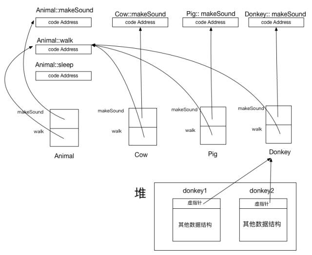

## 预编译/防止重复编译：**#ifndef**
1. 仅在编译阶段起作用
2. 一般大写
3. 格式：只放声明不放定义，除了模板之外
```C
#ifndef __UPPER_NAME_H__  
#define __UPPER_NAME_H__
#include <>/""          //头文件不放到命名空间中：否则定义头文件中所有名字为它的成员
namespace xxx{
    global variable/function
    class{};
]
#endif```
3. 
``` #ifndef ...  #define ... #endif``` 每个头文件都有是个很好的习惯
1. 
\#inlcude 不放到命名空间中：否则定义头文件中所有名字为它的成员；
1. 
头文件如果包括using，则所有包含该头文件的文件都有该using：一般放到函数实现中，所以头文件无！

## 类

```C
#include <stdlib.h>
#include <iostream>
using namespace std;

struct CLS
{
    int m_i;
    //CLS()=default;  当你定义了构造函数，初始化时必须按照此要求来。加上‘=default’可以“留用”编译器的默认构造函数
    explicit CLS(char c); //仅用于单个参数的构造函数：不能发生相应的隐式类型转换：CLS t = CLS(18);CLS t=18错
    CLS( int i ) : m_i(i){}
    CLS()
    {
        CLS(0);  //不行的！！！！下面是方案：new
    }
    ~CLS()=delete;  // 禁止某一个函数
};
int main()
{
    CLS obj;    
    cout << obj.m_i << endl;

    system("PAUSE");
    return 0;
}```

打印结果是不定的:不一定为0 
<br>代码奇怪的地方在于构造函数中调用了自己的另一个构造函数<br>
我们知道，**当定义一个对象时，会按顺序做2件事情**：<br>
    1）分配好内存（非静态数据成员是未初始化的）<br>
    2）调用构造函数（构造函数的本意就是初始化非静态数据成员）<br>
显然上面代码中，CLS obj；这里已经为obj分配了内存，然后调用默认构造函数，但是默认构造函数还未执行完，却调用了另一个构造函数，这样相当于产生了一个**匿名的临时CLS对象**，它调用CLS(int)构造函数，将这个匿名临时对象自己的数据成员m_i初始化为0；但是obj的数据成员并没有得到初始化。于是obj的m_i是未初始化的，因此其值也是不确定的<br>
从这里，**我们归纳如下**：<br>
1）在c++里，由于构造函数允许有默认参数，使得这种构造函数调用构造函数来重用代码的需求大为减少<br>
2）如果仅仅为了一个构造函数重用另一个构造函数的代码，那么完全可以把构造函数中的公共部分抽取出来定义一个成员函数(推荐为private),然后在每个需要这个代码的构造函数中调用该函数即可<br>
3）偶尔我们还是希望在类的构造函数里调用另一个构造函数，可以按下面方式做：<br>
在构造函数里调用另一个构造函数的关键是让第二个构造函数在第一次分配好的内存上执行，而不是分配新的内存，这个可以用标准库的**placement new技术**做到(或者定义一个private函数实现公共功能)：
```C
struct CLS
{
    int m_i;
    CLS( int i ) : m_i(i){}
    CLS()
    {
        new (this)CLS(0);       //即在this空间处重新分配
    }
    CLS():CLS(0){}              //也可使用委托构造函数
};```
所以尽量避免在构造函数中调用构造函数，不管是构造函数自身还是重载过的构造函数

**拷贝构造函数的参数为什么都是引用类型？**
1. 
减少函数调用时的入栈
1. 
主要原因： ```如CLS a = b;内部实现是 a = CLS(b)//b隐式转换，那么构造函数的原型就是 CLS(CLS ex),即CLS a = CLS(CLS ex),然后b会赋值给形参ex，即CLS ex=b。进入死循环了。所以参数需要引用，就不会产生值传递了即不会有赋值操作了。```
1. 
构造函数、拷贝构造、拷贝赋值（**前两个是初始化，后一个是赋值**）
```C++
CLS a(4);           //直接初始化：构造函数
CLS b(a);           //直接初始化：构造函数
CLS c = b;          //拷贝构造初始化
CLS d = CLS(53);    //拷贝构造
d= a;               //拷贝赋值
```

**编译器会在什么情况下创建默认实现，以及创建这些默认实现的原因？**

“在一些类成员（函数）没有被声明的情况下，编译器将使用一系列默认行为：对实例的构造就是分配一部分内存，而不对该部分内存做任何事情；对实例的拷贝也仅仅是将原实例中的内存**按位拷贝**到新实例中；而赋值运算符也是对类型实例所拥有的各信息进行拷贝。而在某些情况下，这些默认行为不再满足条件，那么编译器将尝试根据已有信息创建这些成员的默认实现。这些**影响因素可以分为几种：类型所提供的相应成员，类型中的虚函数以及类型的虚基类。”**

“就以构造函数为例，如果当前类型的成员或基类提供了由用户定义的构造函数，那么仅进行内存拷贝可能已经不是正确的行为。这是因为该成员的构造函数可能包含了成员初始化，成员函数调用等众多执行逻辑。此时编译器就需要为这个类型生成一个默认构造函数，以执行对成员或基类构造函数的调用。另外，如果一个类型声明了一个虚函数，那么编译器仍需要生成一个构造函数，以初始化指向该虚函数表的指针。如果一个类型的各个派生类中拥有一个虚基类，那么编译器同样需要生成构造函数，以初始化该虚基类的位置。<br>这些情况同样需要在拷贝构造函数中考虑：如果一个类型的成员变量拥有一个拷贝构造函数，或者其基类拥有一个拷贝构造函数，位拷贝就不再满足要求了，因为拷贝构造函数内可能执行了某些并不是位拷贝的逻辑(比如有**指针成员**，就会引起浅拷贝)。同时如果一个类型声明了虚函数，拷贝构造函数需要根据目标类型初始化虚函数表指针。如基类实例经过拷贝后，其虚函数表指针不应指向派生类的虚函数表。同理，如果一个类型的各个派生类中拥有一个虚派生，那么编译器也应为其生成拷贝构造函数，以正确设置各个虚基类的偏移。”**注：**位拷贝是浅拷贝

“当然，析构函数的情况则略为简单一些：只需要调用其成员的析构函数以及基类的析构函数即可，而不需要再考虑对虚基类偏移的设置及虚函数表指针的设置。”

“在这些默认实现中，类型实例的各个原生类型成员并没有得到初始化的机会。但是这一般被认为是软件开发人员的责任，而不是编译器的责任。”

**生存周期：**

通常在构造函数中申请内存，析构函数中释放，但是**只有构造函数调用成功，析构函数才会被调用**，换句话说，如果在构造函数中产生了异常，那么析构函数将不会调用，会把已经构造的析构掉。**常识：析构函数不能抛异常：因为异常不一定能处理，如果当前不能处理，那么会继续向上提交，那么未析构的部分将永远无法析构**

**继承控制**

| 基类访问特性 | 基类用户 | 继承方式 | 子类访问特性 | 子类用户 |
| -- | -- | -- | -- | -- | -- |
| public | 可见 |  | public | 可见 | 
| protected | 不可见 | public | protected | 不可见|
| private | 不可见 |  | 无继承 | 不可见 |
| |
| public | 可见 |  | protected | 不可见 | 
| protected | 不可见 | protected | protected | 不可见 |
| private | 不可见 |  | 无继承 | 不可见| 
| |
| public | 可见 |  | private | 不可见 |
| protected | 不可见 | private | private | 不可见 | 
| private | 不可见 |  | 无继承 | 不可见 |
注：
* **private修饰的属性和方法永远不会被继承**
* 
用户是指使用时的用户，而非CPP文件。
* 
基类的访问特性决定那些可以“被继承”，继承说明符决定那些能够被继承的成员继承来后的访问特性。都会继承来，但是不可见而已
* 
**基类的private对象派生类不可见，但是派生类构造时会调用基类构造函数，所以内存布局中有该private但不可访问。**

###[虚函数](http://blog.csdn.net/haoel/article/details/1948051/)

```C
#include <iostream>
using namespace std;
 
class Base1 {
public:
        virtual void f() { cout << "Base1::f" << endl; }
        virtual void g() { cout << "Base1::g" << endl; }
        virtual void h() { cout << "Base1::h" << endl; }
};
 
class Base2 {
public:
        virtual void f() { cout << "Base2::f" << endl; }
        virtual void g() { cout << "Base2::g" << endl; }
        virtual void h() { cout << "Base2::h" << endl; }
};
  
class Base3 {
public:
        virtual void f() { cout << "Base3::f" << endl; }
        virtual void g() { cout << "Base3::g" << endl; }
        virtual void h() { cout << "Base3::h" << endl; }
};
  
class Derive : public Base1, public Base2, public Base3 {
public:
        //virtual void f() { cout << "Derive::f" << endl; }
        virtual void g1() { cout << "Derive::g1" << endl; }
};
  
typedef void(*Fun)(void);
 
int main()
{
    Fun pFun = NULL;
 
    Derive d;
    Base1 b1;
    Base2 b2;
    Base3 b3;
    int** pVtab = (int**)&d;
    int **pVtab1  = (int **)&b1;
    int **pVtab2  = (int **)&b2;
    int **pVtab3  = (int **)&b3;
 
    cout<<"addr of D "<<pVtab[0]<<endl;
    cout<<hex<<pVtab[0][0]<<endl;
    cout<<hex<<pVtab[0][1]<<endl;
    cout<<"addr of B1 "<<pVtab1[0]<<endl;
    cout<<hex<<pVtab1[0][0]<<endl;
     cout<<"addr of B2 "<<pVtab2[0]<<endl;
    cout<<hex<<pVtab2[0][0]<<endl;
     cout<<"addr of B3 "<<pVtab3[0]<<endl;
    cout<<hex<<pVtab3[0][0]<<endl;
    return 0;
}

每个类都有自己的vptr，有的只有一个自己的表，有的是继承来了多个表;
派生类如果没有重写基类的方法，那么虽然vptr[s]不同，但是里面的函数地址相同；===即虚表与类绑定，而不是实例
如果重写了虚函数，那么vptr不同，里面的函数地址也不同。
```

###[其他方式的内存布局](http://mp.weixin.qq.com/s?__biz=MzAxNDI5NzEzNg==&mid=2651156678&idx=1&sn=11e6089d7d57e3342c024487841a8498&scene=0#wechat_redirect)
注意：
    * 适合虚函数：析构、自定义的函数
    * 不适合虚函数：普通函数(重载而不是重写)、构造函数(还不知道对象类型怎么选)、内联(编译时展开)、友元函数(友元不能继承)、
        静态函数(类持有的，不是对象)
    1）虚函数按照其声明顺序放于表中。
    2）父类的虚函数在子类的虚函数前面。

函数调用过程分析：
* 
**先参数入栈===编译器做的**
* 
从虚表中找到函数地址
* 
调用函数
```C
#include <iostream>
using namespace std;
class Base
{
public:
    virtual void print(const int a = 10) {cout<<"Base: "<<a<<endl;}
};
class Derive : public Base
{
public:
    virtual void print(const int a = 100) {cout<<"Derive: "<<a<<endl;}
};
int main()
{
    Base *pb = new Derive;
    pb->print();
    Base& rb = *pb;
    rb.print();
    Derive d;
    d.print();
    Base *pbb = &d; 
    pbb->print();
    Base& rbb = d;
    rbb.print();
    Base b;
    b.print();
    Derive *pd = (Derive*)&b;
    pd->print();
    Derive& rd = *(Derive*)&b;
    rd.print();
    delete pb; 
    return 0;
}
你认为运行后的结果是什么呢？
下面是在我机器上的运行结果（Linux dev 2.6.32，gcc (GCC) 4.8.1）
Derive: 10
Derive: 10
Derive: 100
Derive: 10
Derive: 10
Base: 10
Base: 100
Base: 100
先参数入栈（编译器做的），所以第一个输出10
```
1. 
[类大小及内存管理](http://blog.csdn.net/youoran/article/details/11069803)


[返回目录](README.md)