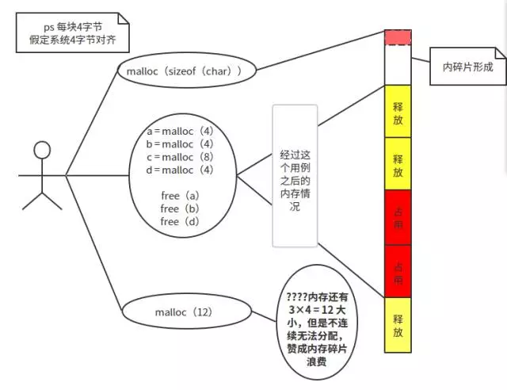
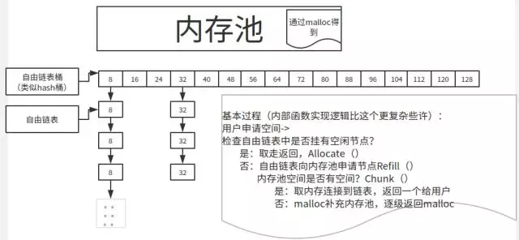

##基本知识
我们知道STL有由六大组件构成：容器、迭代器、算法、适配器、仿函数、配置器；其中，仿函数类似于函数，可以用于算法的策略选择；配置器即我们今天要讲的空间配置器。
###空间配置器简介
STL空间配置器分为两级：
* 
一级空间配置器(__malloc_alloc_template)：申请空间大于128Bytes时,直接包装malloc、realloc、free等函数
* 
二级空间配置器(__default_alloc_template)：申请空间小于等于128Bytes
* 
配置器最小的分辨度是8Byte

由于一级空间配置器包装malloc等函数，所以申请和释放的过程和正常的glibc差不多。我们主要介绍二级空间配置器

对于基本的malloc分配我们都知道，容易产生碎片：



###二级空间配置器
这个分配器采用了**内存池**的思想，有效地避免了内**碎片的问题**（顺便一句话介绍一下内碎片和外碎片：内碎片是已被分配出去但是用不到的内存空间比如申请3B分配4B，外碎片是由于大小太小而无法分配出去的空闲块）。
####过程
首先介绍四个基本的API：
* void* allocate(size_t \__n) 　　　　　　　　　// 外部 API，分配内存
1. 
void deallocate(void* \__p, size_t \__n)　　　　　// 外部 API，回收内存，以供再利用；\__P、\__n必须是allocate得到的；
* 
char* chunk_alloc(size_t \__size, int& \__nobjs)　// 内部函数，用于分配一个大块
* 
void* refill(size_t n) 　　　　　　　　　　　// 内部函数，用于 allocate 从 free_list 中未找到可使用的块时调用

二级空间配置器使用freelist链表的形式管理内存，最小的分辨单位为 8Byte, 其 free_list 数组存着 8*n（n=1…16) 大小内存的首地址, 大小同样的内存块使用链表的形式相连:
```C++
free_list[0] ——–> 8 byte
free_list[1] ——–> 16 byte
free_list[2] ——–> 24 byte
free_list[3] ——–> 32 byte
......
free_list[15] ——-> 128 byte
```
s_free_list是这些空闲分区链的起始地址组成的数组，大小为16。这16个链表中每个链表中的空闲空间的大小都是固定的，第一个链表的空闲块大小是8bytes, 依次是16, 24, 32, 40, 48, 56, 64, 72, 80, 88, 96, 104, 112, 120, 128bytes。

另外还有三个指针s_start_free, s_end_free, s_heap_size。它们分别指向整个内存池的起始地址，结束地址和可用空间大小。



 ###分配内存过程：
* 
如果申请的内存空间大于**128bytes**, 则交由第一个分配器处理
* 
分配器首先将申请内存的大小上调至8的倍数n，并根据n找出其对应的空闲链表地址__my_free_list
* 
如果该空闲链表中有可用的空闲块，则将此空闲块从链中移除、返回并更新__my_free_list，否则转到下一步
* 
到这一步，说明__my_free_list中没有空闲块可用了，分配器会按照下面的步骤处理：
    * 
调用refill函数，向内存池**申请20个大小的内存**，挂在到对应的freelist上：保证下一次一定有
    * 
内部调用_s_chunk_alloc()申请大小为n\*20的内存空间，注意的是，此时不一定能申请到n*20大小的内存空间
    * 
如果只申请到大小为n的内存空间，则返回给用户，否则到下一步
    * 
将申请到的n\*x(a中说了，不一定是n*20)内存块取出一个返回给用户，其余的内存块链到空闲链表__my_free_list中

#####_s_chunk_alloc()的具体过程为：
* 
如果_s_start_free和_s_end_free之间的空间足够分配n\*20大小的内存空间，则从这个空间中取出n*20大小的内存空间，更新_s_start_free并返回申请到的内存空间的起始地址，否则转到下一步
* 
如果_s_start_free和_s_end_free之间的空间足够分配大于n的内存空间，则分配整数倍于n的内存空间，更新_s_start_free，由nobj返回这个整数，并返回申请到的内存空间的起始地址；否则转到下一步
* 
到这一步，说明内存池中连一块大小为n的内存都没有了，此时如果内存池中还有一些内存（这些内存大小肯定小于n），则将这些内存插入到其对应大小的空闲分区链中
* 
调用malloc向运行时库申请大小为（2\*n\*20 + 附加量）的内存空间， 如果申请成功，更新_s_start_free, _s_end_free和_s_heap_size，并重新调用_s_chunk_alloc()，否则转到下一步
* 
到这一步，说明4)中调用malloc失败，这时分配器依次遍历16个空闲分区链，只要有一个空闲链，就释放该链中的一个节点，重新调用_s_chunk_alloc()

####内存释放过程：
　　内存的释放过程比较简单，它接受两个参数，一个是指向要释放的内存块的指针p，另外一个表示要释放的内存块的大小n。分配器首先判断n：
* 
如果n>128bytes，则交由第一个分配器去处理；
* 
否则将该内存块加到相应的空闲链表中。==========》所以最终释放的内存还在链表中，而不是给Heap

###总结
* 
开始时，内存池为空，调用malloc申请：**2\*n\*20**个大小的区域，一半给申请的链表，一半留在内存池保证下次还有；
* 
每次调用allocate(n)申请，首先n按8B对齐，找到对应的链表，看有没有空闲块：
    * 
有：移除并返回一块；
    * 
无：调用refill向内存池申请**20\*n**个大小的内存，具体是chunk_alloc函数实现：
        1. 
chunk_alloc查看内存池是否满足20\*n，如果可以分配给对应的链表20个；一个返回给申请者，剩下19个挂在到链表；
        1. 
如果内存池不够20\*n个，但是够n个的，那么就安装n的倍数分配给对应链表；
        1. 
如果连一个n的都不够，那么就把内存池剩余的当一块挂到对应的链表上，chunk_alloc调用malloc向内存申请：
            * 
申请的大小是：**2\*20*n**，即两倍大小，也是为了保证下次申请还有；
            * 
malloc申请指定大小的内存，更新start_free、end_free、heap_size
            * 
如果失败，遍历所有的链表，把空闲块的释放到内存池中，再次调用chunk_alloc
* 
内存池中的内存都是连续的
* 
申请大小：大于128B直接找一级，不大于128B才找二级
    * 
申请者向链表申请时：指定自己想要的大小n
    * 
链表向内存池申请时：要20倍个，如果没有尽可能n的倍数给；
    * 
内存池向OS堆申请时：直接要40倍；
    * 
为什么这么多倍？？？ 因为希望下一次申请时可以直接够


####例子:
* 
当第一次调用chunk_alloc(32,10)的时候，表示我要申请10块__Obje(free_list)， 每块大小32B，
此时，内存池大小为0，从堆空间申请32\*20的大小的内存，把其中32*10大小的分给free_list[3];
* 
我再次申请64*5大小的空间，此时free_list[7]为0， 它要从内存池提取内存，而此时内存池剩下320B，
刚好填充给free_list[7]，内存池此时大小为0。
* 
我第三次申请72\*10大小的空间，此时free_list[8]为0，它要从内存池提取内存，此时内存池空间
不足，再次从堆空间申请72\*20大小的空间，分72\*10给free_list用。

###注：其实不是n，而是n对齐8B之后的大小

[返回目录](README.md)