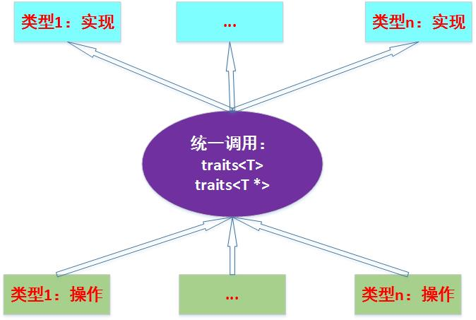

##基本知识
STL的设计非常巧妙，组件间互取短长，形成了一个世界，这是这个世界里的组件：
1. containers（容器）：所谓容器，是指存放数据的地方，将数据以一定的方法组织存放。根据不同的组织方式，可以把容器分为顺序容器，如vector、deque、list，关联容器，如set、map。Container是一种class template。
2. algorithm（算法）：各种常用不常用的算法如sort、copy、search等等。algorithm是一种function template。
3. iterator（迭代器）：迭代器是算法和容器之前的胶合剂，算法作用于容器之上，但算法以迭代器作为形参。从实现上看，迭代器是一种将operator*，operator++，operator--，operator->等指针相关操作予以重载的class template。所以容器都带有自己的迭代器，因为只有容器设计者才知道如何遍历自己的元素。
4. functors（仿函数）：行为类似函数，可作为算法的某种策略。从实现的角度来看，仿函数是一种重载了operator()的class或class template，它常常是算法的一个输入，类似于一种策略。
5. adapters（适配器）：用来形容容器、迭代器或仿函数接口的东西，有时候上面那些组件的行为可能跟我们想要的约束不大一样，于是给它们包装一下，使它们遵守一定的行为。
6. allocator（配置器）：负责空间配置与管理。从实现的角度来看，配置器是一种实现了动态空间配置、管理、空间释放的class template。
 
###迭代器
迭代器在元素操作的时候需要用到以下五种类型：
* 
value_type: 代表迭代器所指对象的类型。
* 
difference_type:代表两个迭代器之间的距离
* 
reference_type:代表迭代器所指对象的引用类型。简言之，它是operator*()的返回类型
* 
pointer_type:代表迭代器所致对象的指针类型。简言之，它是operator->()的返回类型
* 
iterator_category:代表1中提出的五种迭代器的类型标识

##[Traits](http://www.cnblogs.com/hush/archive/2004/03/10/2717.html)
traits的目的是：让属于同一个概念的、具有不同特性的模型，对外暴露一致的接口。允许系统在编译时根据类型作一些决断，就好像在运行时根据值来作出决断一样。
###实现
* 
比如我们有一个迭代器类：
```C++
template <typename T>
class myIterator
{
        ...
};
```
    * 
如果我们希望获得它**内部指向对象的类型**，那么我们只需要内嵌一个typedef即可：
```C++
    template <typename T>
    class myIterator
    {
            typedef T value_type;
            ...
    };
```
    * 
然后我们就可以通过```myIterator<T>::value_Type```获得指向的对象类型，接着我们使用就可以了：
```C++
    template <typeneme T>
    typename myIterator<T>::value_type func(myIterator<T> i)
    {
            ...
    }
```
<hr>
问题是：如果我们希望func函数可以**适应于所有的迭代器**，那么怎么办？？？
```C++
template <typename I>           //这里的I可以是任意类型的迭代器
typename I::value_type Foo(I i)
{
            ...
}
```
但是这引出了一个问题：原生指针也可以作为迭代器使用，那么这种方式是不可以实现的，怎么解决？？？
<hr>
* 
解决方案：traits
    * 
我们*在**函数调用和原始类型之间加一层专门萃取类型的中间层**：traits*！！
```C++
    template <typename T>
    class traits
    {
            typedef typename T::value_type value_type;
    };
```
    * 
我们通过```traits<myIterator<T>>::value_type```来获得myIterator的元素类型；
    * 
可是原生指针的问题还么解决？？？ ===============》C++的**模板偏特化**：
```C++
    template <typename T>
    class traits<T *>
    {
            typedef typename T value_type;
            ...
    }
```
* 
使用：
```C++
    template <typename T>
    class traits
    {
            typedef typename T value_type;
            ...
    };
    
    template <typename T>
    class traits<T *>
    {
            typedef typename T value_type;
    };
============================================================================
    template <typename T>
    typename traits<T>::value_type func(T i)
    {
            typename T temp;
            return func(i,temp);
    }
    template <typename T>
    typename traits<T>::value_type func(T i,int t)
    {
            return i;
    }
    template <typename T>
    typename traits<T>::value_type func(T i,int* t)
    {
            return *i;
    }
===========================================================================
    int i = 10;
    int *j = new int (100);
    　
    func(i);                //调用普通int版本
    func(j);                //自动调用偏特化的版本
```
* 
概述：我们**使用traits把它们的类型都萃取出来**，调用具体的实现




[返回目录](README.md)