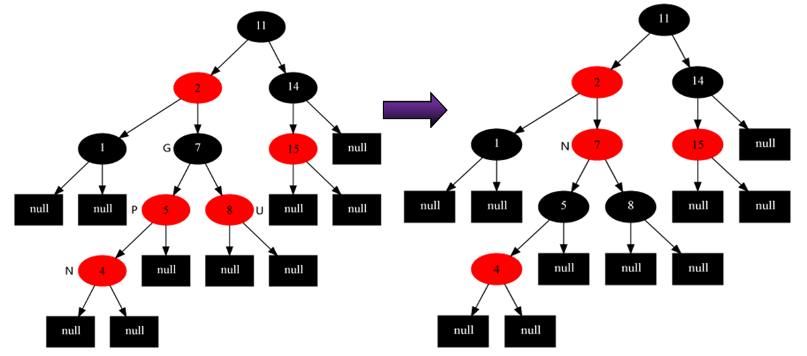
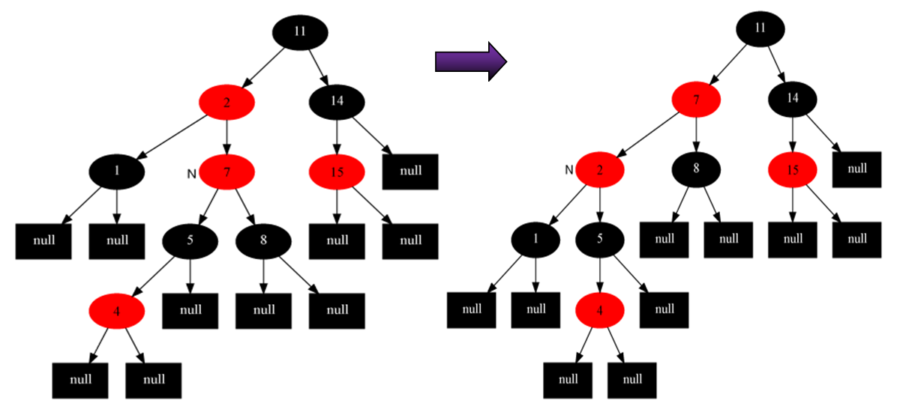
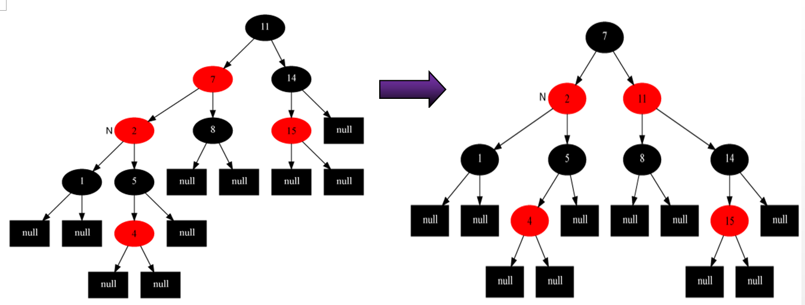
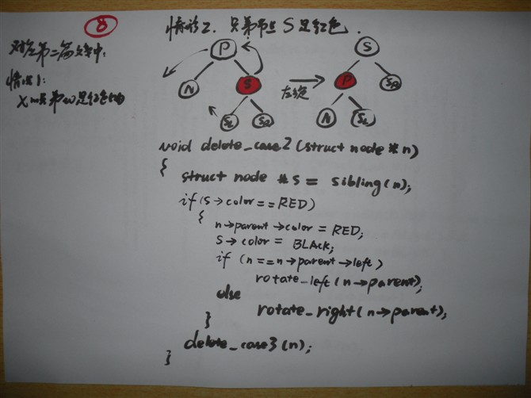
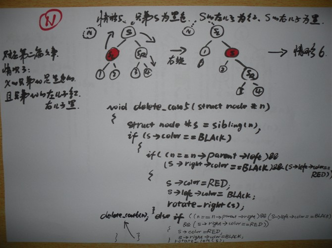

##[红黑树](http://blog.csdn.net/chenhuajie123/article/details/11951777)
* 
性质：是平衡二叉树的一种
    * 
所有节点非红即黑
    * 
所有红节点的子节点(nil)都是黑的
    * 
根节点是黑的
    * 
叶子节点(NIL指针，仅代表树在此结束)和NULL节点是黑的
    * 
对每个结点，从该结点到其子孙结点的所有路径上包含相同数目的黑结点。
#### 使一棵n个结点的红黑树始终保持了logn的高度，从根到叶子的最长的可能路径不多于最短的可能路径的两倍长：注意到性质2导致了路径不能有两个毗连的红色节点就足够了。<br>最短的可能路径都是黑色节点，最长的可能路径有交替的红色和黑色节点。因为根据性质4所有最长的路径都有相同数目的黑色节点，这就表明了没有路径能多于任何其他路径的两倍长。


####6.1 红黑树5种插入的几种情况：
红黑树保证最深不会比最浅两倍：**待插入的涂红色**，然后在修改
* 
情况0：当前无节点，自己是根节点-----------》直接着黑色即可
* 情况1：父亲是黑色-------------------------------》直接插入即可

　　　　　以上两种情况都是不用修复红黑树的！<br>
　　　　　但存在下面三种需要修复的情况：**要插入节点的父节点为红色**
* 
情况2：父亲是红色
    * 2.1
叔叔y是红色的：爷爷肯定是黑的！
        * 
方案：父节点和叔叔节点涂黑，祖父结点涂红，把当前结点指向祖父节点；重新开始算法（调整）。

    * 2.2
叔叔y是黑色的，且自己是右孩子
        * 
方案：父节点做为新的当前节点，以新当前节点为支点左旋。当前节点不变继续调整；

    * 2.3
叔叔y是黑色的，且自己是左孩子
        * 
方案：父节点变为黑色，祖父节点变为红色，在祖父节点为支点右旋。


####6.1.1伪代码实现
```C
n->color = RED;
//空树时
    void insert_case1(node n) {
        if (n->parent == NULL)
            n->color = BLACK;
        else
            insert_case2(n);
    }  
//父亲为黑色
    void insert_case2(node n) {
        if (n->parent->color == BLACK)
            return;     /* 树仍旧有效 */
        else
            insert_case3(n);
    }   
//父亲叔叔都是红色
    void insert_case3(node n) {
        if (uncle(n) != NULL && uncle(n)->color == RED) {
            n->parent->color = BLACK;
            uncle(n)->color = BLACK;
            grandparent(n)->color = RED;
            insert_case1(grandparent(n));   //因为祖父节点可能是红色的，违反性质4，递归情形1.
        }
        else
            insert_case4(n);   //否则，叔叔是黑色的，转到下述情形4处理。
    }   
//父亲红色，叔叔黑色：自己是右孩子，父亲是左孩子
    void insert_case4(node n) {
        if (n == n->parent->right && n->parent == grandparent(n)->left) {
            rotate_left(n->parent);
            n = n->left;
        } else if (n == n->parent->left && n->parent == grandparent(n)->right) {
            rotate_right(n->parent);
            n = n->right;
        }
        insert_case5(n);    //转到下述情形5处理。
    }   
//父亲红色，叔叔黑色：自己是左孩子，父亲也是左孩子
    void insert_case5(node n) {
        n->parent->color = BLACK;
        grandparent(n)->color = RED;
        if (n == n->parent->left && n->parent == grandparent(n)->left) {
            rotate_right(grandparent(n));
        } else {
            /* 反情况，N 是其父节点的右孩子，而父节点P又是其父G的右孩子 */
            rotate_left(grandparent(n));
        }
    }   
```

####6.2 红黑树删除的几种情况：如果删除点是黑/红的...
* 
情况1：自己是黑的且是根=====》不用处理
* 
情况2：自己是红的 =======》描黑即可
* 
**自己是黑的且不是根节点**的：
    * 情况3：
n的兄弟s是红色的======》兄弟描黑，父亲描红，然后兄弟左旋上来取代父亲

    * 情况4：
n的兄弟s是黑色的，且s的俩个孩子都是黑色的。======》兄弟描红，删除父亲

    * 情况5：
n的兄弟s是黑色的，且s的左孩子是红色，s的右孩子是黑色。======》兄弟描红，左孩子描黑，左孩子右旋上来

    * 情况6：
n的兄弟s是黑色的，且s的右孩子是红色的。======》兄弟描父亲颜色，父亲描黑，右孩子描黑，兄弟左旋上来


####6.2.1实现

```C++
void delete_case1(struct node *n)
{
        if (n->parent != NULL)
                delete_case2(n);
}
void delete_case2(struct node *n)
{
        struct node *s = sibling(n);
 
        if (s->color == RED) {
                n->parent->color = RED;
                s->color = BLACK;
                if (n == n->parent->left)
                        rotate_left(n->parent);  //左旋
                else
                        rotate_right(n->parent);
        } 
        delete_case3(n);
}
void delete_case3(struct node *n)
{
        struct node *s = sibling(n);
 
        if ((n->parent->color == BLACK) &&
            (s->color == BLACK) &&
            (s->left->color == BLACK) &&
            (s->right->color == BLACK)) {
                s->color = RED;
                delete_case1(n->parent);
        } else
                delete_case4(n);
}
void delete_case4(struct node *n)
{
        struct node *s = sibling(n);
 
        if ((n->parent->color == RED) &&
            (s->color == BLACK) &&
            (s->left->color == BLACK) &&
            (s->right->color == BLACK)) {
                s->color = RED;
                n->parent->color = BLACK;
        } else
                delete_case5(n);
}

void delete_case5(struct node *n)
{
        struct node *s = sibling(n);
 
        if  (s->color == BLACK) 
                if ((n == n->parent->left) &&
                    (s->right->color == BLACK) &&
                    (s->left->color == RED)) { 
                        // this last test is trivial too due to cases 2-4.
                        s->color = RED;
                        s->left->color = BLACK;
                        rotate_right(s);
                } else if ((n == n->parent->right) &&
                           (s->left->color == BLACK) &&
                           (s->right->color == RED)) {
                       // this last test is trivial too due to cases 2-4.
                        s->color = RED;
                        s->right->color = BLACK;
                        rotate_left(s);
                }
        }
        delete_case6(n);  //转到情况6。
}
void delete_case6(struct node *n)
{
        struct node *s = sibling(n);
 
        s->color = n->parent->color;
        n->parent->color = BLACK;
 
        if (n == n->parent->left) {
                s->right->color = BLACK;
                rotate_left(n->parent);
        } else {
                s->left->color = BLACK;
                rotate_right(n->parent);
        }
}
```

所以为了使插入、或删除结点后的树依然维持为一棵新的红黑树，
那就要做**三方面**的工作：
* 0
首先要查找到结点要插入、删除的位置，然后进行插入、删除
* 1
部分结点颜色，重新着色
* 2
调整部分指针的指向，即左旋、右旋。
* 
插入操作：解决的是 红-红 问题
* 
删除操作：解决的是 黑-黑 问题

[返回目录](README.md)