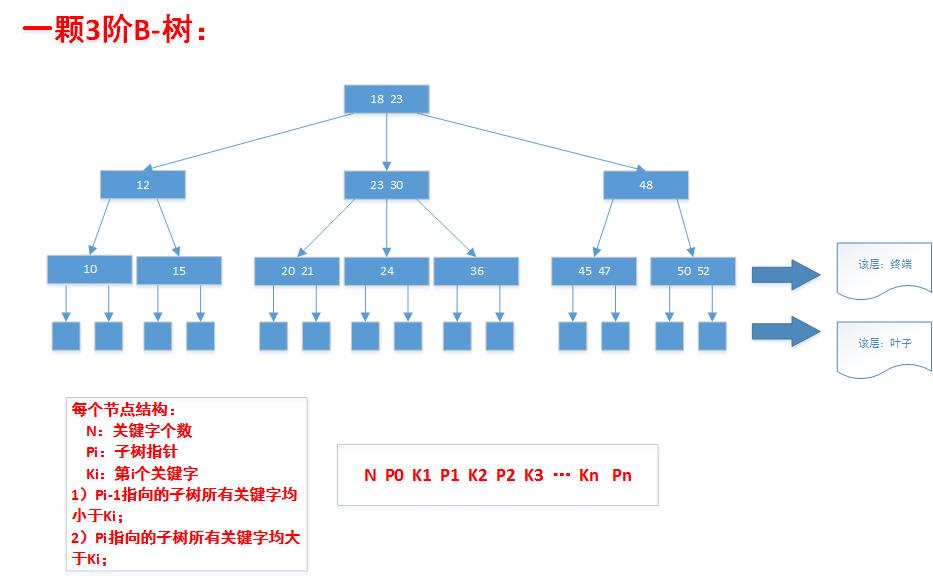
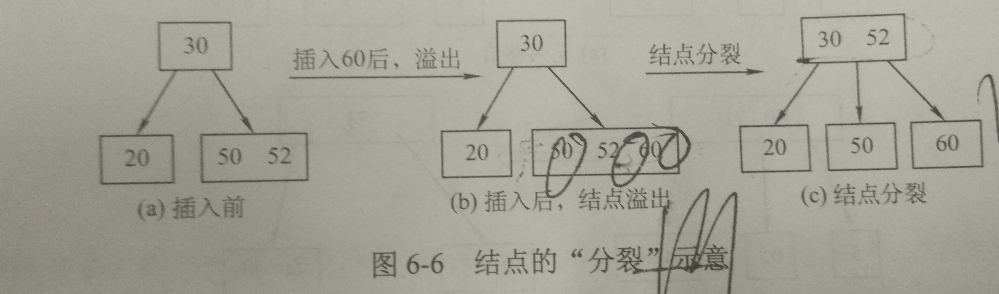
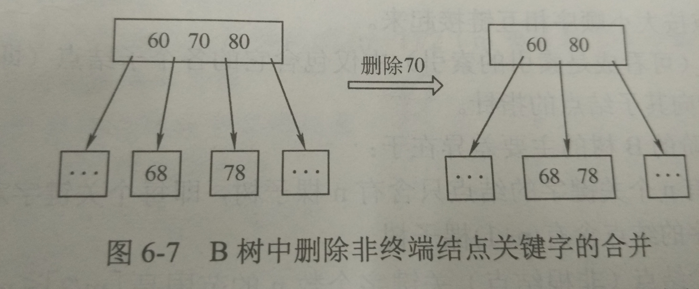
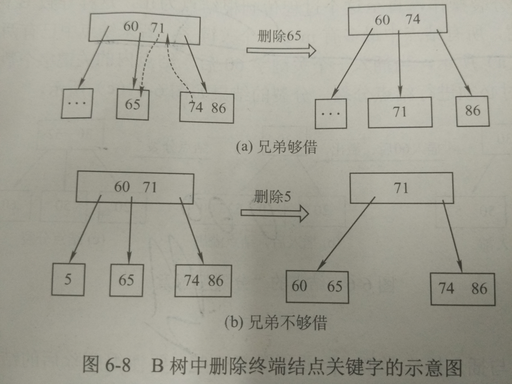
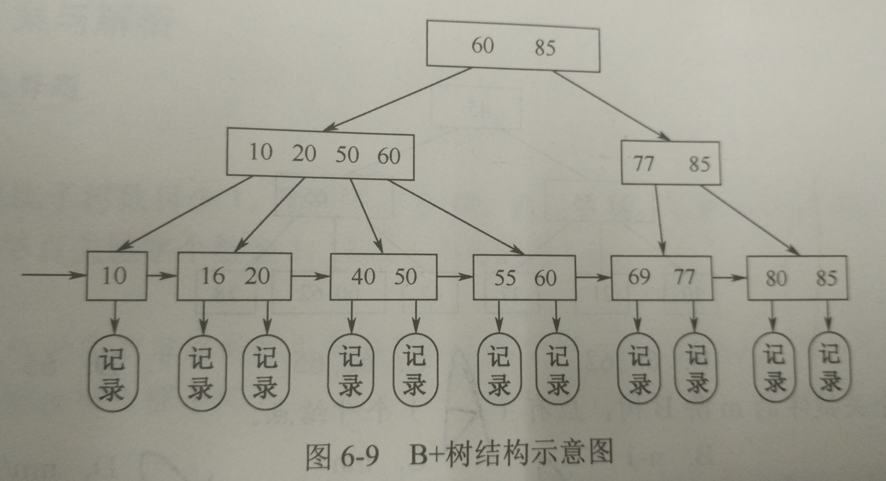

#查找：
* 
####静态查找：只查找是否在表中
* 
####动态查找：增、删节点

#常用算法
###0.[KMP](kmp.md)
###1. 折半查找又称二分查找
* 
思想：在有序表中查找，不断的折半！
* 
实现
```C++
//顺序表：数组
int bin_search(SStable ST,keyType key)
{
    low = 1;high=ST.length;
    while(low<=high)
    {
        mid = (low+high)/2;
        if(ST[mid]<key)
            low = mid;
        else if(ST[mid]>key)
            high = mid;
        else
            return mid;
    }
}
```
* 
分析：在查找成功的情况下和判定树的深度有关：比较次数至多 floor(log2(n))+1，平均：log2(n+1)-1

###2.分块查找、索引顺序查找
* 
思想：在顺序查找基础上建立一个索引表：对所有的元素分块，索引表就是对块的索引，记录块号起始位置和块中最大关键字，先在索引表中找块号，然后在该块中查找即可！

###3.[二叉排序、二叉平衡树](BST.md)

###4.B：B-树、B+树、B*树.
####4.1 B-树又称多路平衡查找树

**一颗m阶的B-树：**就是任一个节点的子树最大m个即最多含有m-1个关键字
* 
每个节点至多有m颗子树(即最多m-1个关键字)，
* 
根节点如果不是终端节点，那么至少有两颗子树；
* 
除了根节点外的每个非叶子节点至少ceil(m/2)颗子树(即ceil(m/2)-1个关键字)。
* 
所有的叶子节点在同一层级上，且不带数据（可以认为是查找失败）；
* 
除叶子节点外的每个节点有关键字列表和指向子树的指针，关键字形成的范围是子树
<br>
```
1、所以B树的添加永远是在最底层的非叶子节点
2、根节点不是终端节点：【2，m】颗子树即【1，m-1】个关键字
3、非叶子节点：【ceil(m/2),m】颗子树即【ceil(m/2)-1,m-1】个关键字
```

####4.1.1 B树查找：
B树一般是存储在硬盘中，查找的过程分两步：找节点，找关键字；先在磁盘上查找节点，然后将节点读入内存，顺序查找或者二分查找对应的关键字，如果没有则进入对应的子树中继续查找；如果到空节点说明没有找到；

####4.1.2 B树插入：【小心多于m个子树】
* 
因为m阶B-树的定义，每次插入一定是底层节点，每个普通节点【ceil(m/2) , m】颗子树即【ceil(m/2)-1 , m-1】个关键字，所以插入时要判断是否超出m-1个关键字，如果是需要**分裂**
* 
分裂（向上分裂）：把关键字插入到对应节点中，该节点关键字个数超出m-1===》分裂。
    * 
由于叶子节点需要在同一层级上，所以向上分裂
    * 
将**节点分成三部**分：左半部(可以保存在原始节点中)、右半部（新建一个节点保存）、ceil(m/2)
    * 
左半部和右半部留下，将ceil(m/2)插入到父节点；
    * 
如果父节点中关键字个数不大于m-1正常，如果超过了，则继续向上分裂，到根节点的话那就**树高加1**；


####4.1.1 B树删除：【小心小于个ceil(m/2)子树】
* 
删除非终端节点：
    * 
如果左子树中关键字个数大于ceil(m/2) - 1，则从左子树拿走最大的值，递归处理左子树
    * 
如果右子树中关键字个数大于ceil(m/2) - 1，则从右子树拿走最小的值，递归处理右子树
    * 
如果两颗子树关键字个数均为ceil(m/2) - 1，则合并两个子节点



* 
删除终端节点：
    * 
若关键字所在节点中关键字总数大于ceil(m/2) - 1，从孩子处借；
    * 
若总数不大于ceil(m/2) - 1，则跟相邻兄弟借：
        * 
兄弟够借：两兄弟间父亲拿下来补充该删除节点，兄弟借的（最小或者最大，取决与左右兄弟）当两兄弟父亲
        * 
兄弟不够借：父亲关键字下来直接和兄弟关键字所在节点一起。
        * 
上述过程，不断向上借，直到满足了或者到根节点了，那么删除根节点，自己为根节点，**树高减1**。



####4.2 B+树 应用于数据库
B+树提出来的背景，就是为了减少查找时产生的磁盘磁道寻道次数。若某次寻址用4ms,但真正读取的时间连1ms都不到,所以磁盘顺序读写快，随机读写慢。=====》主要花费在寻道上
* 
####4.2.1 B+树定义：
* 
每个普通节点最多m颗子树
* 
非叶根节点至少2颗子树，其他至少ceil(m/2)颗子树
* 
但是节点子树个数和关键字个数相同
* 
所有叶节点包含所有关键字及指向记录的指针
* 
普通节点包含他的对应子节点中关键字的最大值和指向子节点的指针



####4.2.2 B+树和B-树区别：
* 
B+树非叶子节点中n个关键字对应n个子树，B-树中n个关键字n+1颗子树
* 
B+树中叶子节点才有用，包含所有关键字和信息，非叶子只是索引而已，B-树中，叶子节点无用代表找不到信息；
* 
B+树中有两个指针：一个是根节点代表从上到下查询，另一个是最小关键字(最左边)代表从关键字找。因此B+树可以实现**两种查找运算**。
* 
个数范围：<br>

|  | B+ | B- |
| -- | -- |
| 子树个数 | 【1，m】、 【ceil(m/2)，m】 | 【2，m】、【ceil(m/2)，m】 |
| 关键字个数 | 【1，m】、 【ceil(m/2)，m】 | 【1，m-1】、【ceil(m/2)-1，m-1】 |
|  | 关键字 = 子树 | 关键字 = 子树 - 1 |

###5.[哈希](http://blog.csdn.net/chenhuajie123/article/details/9210091)：一个关键字对应一个存储位置
* 
最大优点：**能够在O(1)内找到某一元素**

数组的特点是：寻址容易，插入和删除困难；而链表的特点是：寻址困难，插入和删除容易。<br>那么我们能不能综合两者的特性，做出一种寻址容易，插入删除也容易的数据结构?====》哈希表

在计算机程序中，如果需要在一秒种内查找上千条记录通常使用哈希表（例如拼写检查器)哈希表的速度明显比树快，树的操作通常需要O(N)的时间级。哈希表不仅速度快，编程实现也相对容易。
* 
冲突：关键字不同，哈希地址相同。冲突不可避免
* 
根据设定的哈希函数(5.1)和处理冲突(5.2)的方法将关键字映射到一个地址集上。
####5.1.1直接定址法
* 
直接根据关键字得到哈希地址：H(key)=key/a*key+b
* 
冲突少，但是地址集与关键字集大小相同，使用较少。
####5.1.2数字分析法
* 
以关键字的某些位组成哈希地址
####5.1.3平方取中法
* 
取关键字平方后的中间几位为哈希地址
####5.1.4折叠法
* 
将关键字分割为位数相同的几部分，然后取叠加和作为哈希地址
####5.1.5除留余数法
* 
对某个小于哈希表表长的数p取余得到的为哈希地址：取余前可以折叠、平方等。p的选择至关重要
####5.1.6随机数法
* 
取关键字的随机函数值为哈希地址。<HR>
####5.2.1开放定址法
* 
根据增量序列来不断得到新的地址：1，-1,4,-4，...
*   
容易产生冲突聚集
####5.2.2 再哈希法
* 
针对冲突再使用一个新的哈希函数计算
* 
不易产生冲突聚集，但增加计算时间
####5.2.3 链地址法
* 
建立一个链表数组，每个链表代表一种可能，所有相同的hash值都放到链表尾部即可。
####5.2.4 公共溢出区
* 
针对冲突再建立一个溢出区，所有冲突放在此处。

    *[Hash资料](http://blog.csdn.net/wenyiqingnianiii/article/details/52204136)

###6.[一致性哈希](http://blog.csdn.net/sparkliang/article/details/5279393)

###7.[红黑树](br.md)


[返回目录](README.md)