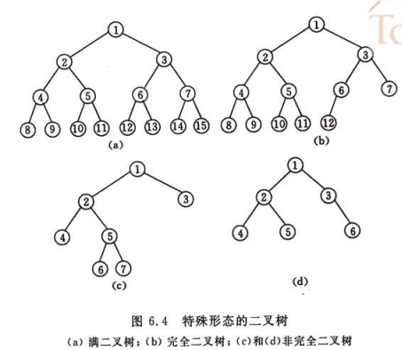

#树型结构
1. 
树是n(n>=0)个节点的有限集，如果非空：<br>
　　１）有且仅有一个根节点<br>
　　２）每个节点有且仅有一个父亲节点，可有多个子节点
1. 
基本概念：<br>
节点的子树数称为节点的度<br>
节点的层次从根节点第一层开始算，最大的层次称为树的深度<br>
从下往上称为高度<br>
1. 
性质：<br>
    节点数等于所有节点的度加1
1. 
二叉树：每个节点最多两个字树，而且字树有左右之分<br>
满二叉树与完全二叉树：<br>


完全二叉树以数组表示：第一个非终端节点是第**floor(n/2)**个元素，所有1~floor(n/2)的节点左右子树：2i, 2i+1
<br>存储：链式为主。
```C
typedef struct BitNode{
    TElemType data;
    struct BitNode *lchild,*rchild;
}BitNode,*BiTree;
有N个节点的二叉树就会有N+1个空指针
```
遍历：先根遍历、中根遍历、后根遍历
```C
status PreOrder(BiTree T){
    if(T){
        print(T->data);
        PreOrder(T->lchild);
        PreOrder(T->rchild);
    }
}
status InOrder(BiTree T){
    if(T){
        InOrder(T->lchild);
        print T->data;
        InOrder(T->rchild);
    }
}
status PostOrder(BiTree T){
    if(T){
        PostOrder(T->lchild);
        PostOrder(T->rchild);
        print(T->datat);
    }
}
有先序和中序、中序和后序、中序和层序可以唯一确定一个二叉树。但是先序和后序不可以。
```
## [二叉排序树、二叉平衡树](BST.md)

## [霍夫曼树](Huffman.md)


[返回目录](README.md)