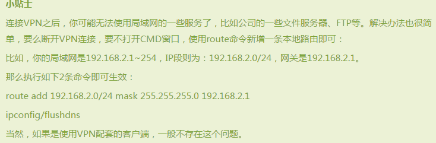

------------------------
### 搭建自己的VPN

#####VPS：虚拟主机，位于公共网络上，提供网络服务

#####VPN：软件或者说电脑上的一个服务，有客户端和服务器端之分，

####========》服务器端运行在VPS上

------------------

##[帮瓦工](https://bwh1.net/)（bangwagon）教程
1. 注册
2. 购买一个，付款即可
3. 设置：
    1. 登录进入个人服务。services > my service
    2. 显示已购买的服务产品。点击KiwiVM Control Panel，进入控制面板
    3. 可以安装系统等各种配置（记住登录名root以及密码*****）
4. 远程登录VPS，window使用Xshell软件
    1. 上步3的信息登录
    2. 安装shadowsocks
```C++
      Debian/Ubuntu:
        apt-get install python-pip
        pip install shadowsocks 
      CentOS:
        yum install python-setuptools && easy_install pip
        pip install shadowsocks
```
    2. 在/etc/shadowsocks/文件夹下创建文件config.jason
        内容如下：
```python
单用户：
      ｛
          “server_port”：****，
          “password”:_____(需要“”),
          "timeout":((((,
          "method":》》》》（需要“”）
      ｝
多用户：
            {
            "server":"my_server_ip",  #填入你的IP地址
             "local_address": "127.0.0.1",
             "local_port":1080,
             "port_password": {
                "8381": "foobar1",    #端口号，密码
                "8382": "foobar2",
                "8383": "foobar3",
                "8384": "foobar4"
             },
            "timeout":300,
             "method":"aes-256-cfb",
            "fast_open": false
            }
            Explanation of the fields(配置说明):
            
            Name	        Explanation
            server	       the address your server listens
            server_port 	 server port
            local_address    the address your local listens
            local_port	   local port
            password	     password used for encryption
            timeout	      in seconds
            method	       default: “aes-256-cfb”, see Encryption
            fast_open	    use TCP_FASTOPEN, true / false
            workers	     number of workers, available on Unix/Linux
```
然后按Esc退出编辑，按shift+:，输入wq，回车，就保存退出了。
现在就可以启动了，有两种方式启动，前端和后端。 
```python
前端启动：ssserver -c /etc/shadowsocks.json
后端启动：ssserver -c /etc/shadowsocks.json -d start (-q)
停止：ssserver -c /etc/shadowsocks.json -d stop
重启(修改配置生效)：ssserver -c /etc/shadowsocks.json -d restart
查看是否成功：ps -ef | grep ssserver
```
####设置开机启动 
在终端输入vi /etc/rc.local， 
把里面最后的带有ssserver的一大段默认的代码删除掉， 
再把ssserver -c /etc/shadowsocks.json -d start加进去， 
按wq保存退出。

###客户端配置
1. 下载shadowsock客户端
2. 安装
3. 配置：
    1. 服务器 》 编辑服务器
        1. IP就是你的VPS的IP
        2. 服务器端口就是配置文件中配置的端口
        3. 密码就是对应的密码
        4. 加密要对应好。
        5. 代理端口一般是1080
        6. 添加即可
        7. 上述对应都是服务器端的设置
    2. 系统代理即全局代理，
    3. chrome可以下载SwitchyOmega进行配置，这样只有chrome可以走代理，其余不走
    4. chrome ：：SwitchyOmega配置
    
    
[返回目录](SUMMARY.md)