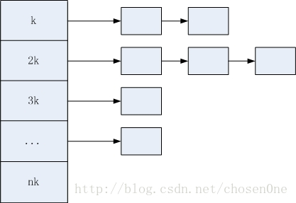
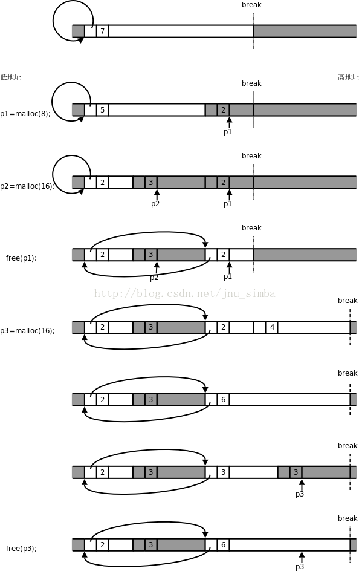
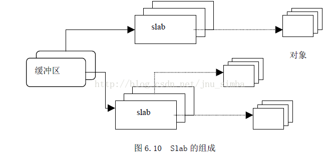
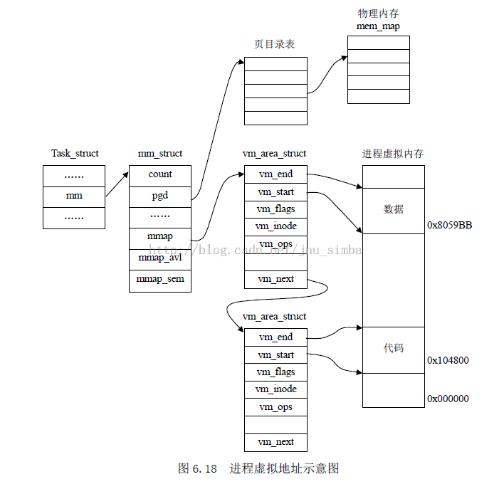

###几个函数
* 
malloc：申请一段内存，不初始化；所以第一次读取数据时会发生缺页中断，进入内核态。
* 
calloc：申请一段内存，初始化为0
* 
realloc：重新对原有的空间，分配大小。一般是扩容：realloc(pt, 1000*sizeof(char));重新分配新块。注意如果扩容，后面添加的是未初始化的信息。同样，如果分配失败，以前的部分也没有了，所有要判断。
* 
alloca：最特殊的开辟栈空间方法，优点是当离开调用这个函数的时候，栈所分配的空间会自动释放（也就是free）

###基础点
当一个进程发生缺页中断的时候，进程会陷入内核态，执行以下操作： 
* 
检查要访问的虚拟地址是否合法 
* 
查找/分配一个物理页 
* 
填充物理页内容（读取磁盘，或者直接置0，或者啥也不干） 
* 
建立映射关系（虚拟地址到物理地址） 
* 
重新执行发生缺页中断的那条指令 

##内存分配器：
* 
dlmalloc - 通用分配器
* 
ptmallac2- glibc
* 
jemalloc - FreeBSD & Firefox
* 
[tcmalloc - Google](http://blog.csdn.net/chosen0ne/article/details/9338591)
* 
libumem - Solaris ...<br>
* 
ptmalloc：用单向循环链表管理空闲块
tcmalloc：用链表数组管理；每个线程独立一个cache（不加锁），进程一个共享cache（加锁）<br>
每种内存分配器都说他们是最快的、可扩展并且具有高效的内存使用！！但是并非所有的分配器都适合我们自己的应用程序。内存消耗大的应用性能很大程度依赖于内存分配器的性能。本文中，我只讨论 "glibc malloc” 内存分配器。并希望今后能涉及到其他内存分配器的讨论。本文中为了更好的理解 ”glibc malloc”,我会联系它最近的源码来谈。
*  
ptmalloc2 来自于 dlmalloc 的分支：因为dlmalloc不支持多线程（它用一个临界段freelist管理所有的堆，大家共享,多线程会竞争）；但是ptmalloc增加了多线程支持（它使每个线程自己管理一个堆分段，因此空闲列表堆段也是自己的）====逐渐形成malloc


###[内存分配](http://blog.csdn.net/littlehedgehog/article/details/2856933)
内存的延迟分配：用户申请内存的时候，只是给它分配了一个线性区（也就是虚存），并没有分配实际物理内存；只有当用户使用这块内存的时候，内核才会分配具体的物理页面给用户，这时候才占用宝贵的物理内存。内核释放物理页面是通过释放线性区，找到其所对应的物理页面，将其全部释放的过程。
* 
分配和释放的调用：**brk(小于128K),sbrk,mmap(大于128K)**,unmmap。**而它们的参数就是虚拟内存**
<br>基于 UNIX 的系统有两个可映射到附加内存中的基本系统调用：
* 
brk：brk() 是一个非常简单的系统调用。 还记得系统中断点吗？该位置是进程映射的内存边界。 brk() 只是简单地 将这个位置向前或者向后移动，就可以向进程添加内存或者从进程取走内存。
* 
mmap：mmap()，或者说是“内存映像”，类似于 brk()，但是更为灵活。首先，它可以映射任何位置的内存， 而不单单只局限于进程。其次，它不仅可以将虚拟地址映射到物理的 RAM 或者 swap，它还可以将 它们映射到文件和文件位置，这样，读写内存将对文件中的数据进行读写。不过，在这里，我们只关心 mmap 向进程添加被映射的内存的能力。 munmap() 所做的事情与 mmap() 相反。 
```C
char *p=malloc(2048); //这里只是分配了虚拟内存2048，并不占用实际内存。 
strcpy(p,”123”) ;//分配了物理页面，虽然只是使用了3个字节，但内存还是为它分配了2048字节的物理内存。 
free(p) ;//通过虚拟地址，找到其所对应的物理页面，释放物理页面，释放线性区。  
```
但并不是每次申请是都系统调用，glibc负责批发和零售<br>
所以：分配的是虚拟内存，没有分配物理内存。在第一次访问已分配的虚拟地址空间的时候，发生**缺页中断**，操作系统负责分配物理内存，然后建立虚拟内存和物理内存之间的映射关系。

##TCmalloc原理
* 
tcmalloc就是一个内存分配器，管理堆内存，主要影响malloc和free，用于降低频繁分配、释放内存造成的性能损耗，并且有效地控制内存碎片。glibc中的内存分配器是ptmalloc2，tcmalloc号称要比它快。一次malloc和free操作，ptmalloc需要300ns，而tcmalloc只要50ns。同时tcmalloc也优化了小对象的存储，需要更少的空间。tcmalloc特别对多线程做了优化，对于小对象的分配基本上是不存在锁竞争，而大对象使用了细粒度、高效的自旋锁（spinlock）。**分配给线程的本地缓存，在长时间空闲的情况下会被回收，供其他线程使用**，这样提高了在多线程情况下的内存利用率，不会浪费内存，而这一点ptmalloc2是做不到的。
* 
tcmalloc区别的对待大、小对象。它为每个线程分配了一个线程局部的cache，线程需要的小对象都是在其cache中分配的，由于是thread local的，所以基本上是无锁操作（在cache不够，需要增加内存时，会加锁）。同时，tcmalloc维护了进程级别的cache，所有的大对象都在这个cache中分配，由于多个线程的大对象的分配都从这个cache进行，所以必须加锁访问。在实际的程序中，小对象分配的频率要远远高于大对象，通过这种方式（小对象无锁分配，大对象加锁分配）可以提升整体性能。
* 
线程级别cache和进程级别cache实际上就是一个多级的空闲块列表（Free List）。一个Free List以大小为k bytes倍数的空闲块进行分配，包含n个链表，每个链表存放大小为nk bytes的空闲块。在tcmalloc中，<=**32KB**的对象被称作是小对象，>32KB的是大对象。在小对象中，<=**1024byte**s的对象以8n bytes分配，1025< size <=32KB的对象以128n bytes大小分配，比如：要分配20bytes则返回的空闲块大小是24bytes的，这样在<=1024的情况下最多浪费7bytes，>1025则浪费127bytes。而大对象是以页大小4KB进行对齐的，最多会浪费4KB - 1 bytes。

    

##glibc的[malloc](http://blog.163.com/xychenbaihu@yeah/blog/static/132229655201210975312473/)内部机制
可以先运行下面的程序，会发现：16、24、32、40(32Bit系统)；32、48、64(64Bit系统)；会有跳变<br>当然也可以用top命令重点才看res(Resident size)指标

```C
#include <stdio.h>
#include <stdlib.h>
void main()
{
    char *p1;
    char *p2;
    int i=1;
    printf("%d\n",sizeof(char *));
    for(;i<100;i++)
    {
        p1=NULL;
        p2=NULL;
        p1=(char *)malloc(i*sizeof(char));
        p2=(char *)malloc(1*sizeof(char));
        printf("i=%d     %d\n",i,(p2-p1));   //两个指针的距离===得到内存布局
    }
　
    getchar();
}
```
####为什么会这样？
不是申请多少用多少吗？从上面知道glibc是批发和零售的，所以不会每次都去“进货”，那么一次批发多少？
<br>通过查看glibc源码中malloc.c可知：
```C
#ifndef INTERNAL_SIZE_T  
#define INTERNAL_SIZE_T size_t  
#endif  
#define SIZE_SZ                (sizeof(INTERNAL_SIZE_T))  
#ifndef MALLOC_ALIGNMENT  
#define MALLOC_ALIGNMENT       (2 * SIZE_SZ)  
#endif  

/*===================================================================
    MALLOC_ALIGNMENT：是不是对齐单位？
    不是，这个是每次申请空间大于阀值(下面的MINSIZE)时，补充的大小；
===================================================================*/
//注：在glibc中空闲的内存块会由双链表连起来，每个链表结点就是一个管理单元，它的结构定义如下：

struct malloc_chunk {  
  INTERNAL_SIZE_T      prev_size;  /* Size of previous chunk (if free).  */  
  INTERNAL_SIZE_T      size;       /* Size in bytes, including overhead. */  
  struct malloc_chunk* fd;         /* double links -- used only if free. */  forward point
  struct malloc_chunk* bk;              // back point
};  

/*=================================================================================
    An allocated chunk looks like this:  
    chunk-> +-+-+-+-+-+-+-+-+-+-+-+-+-+-+-+-+-+-+-+-+-+-+-+-+-+-+-+-+-+-+-+-+  
            |             Size of previous chunk, if allocated            | |  
            +-+-+-+-+-+-+-+-+-+-+-+-+-+-+-+-+-+-+-+-+-+-+-+-+-+-+-+-+-+-+-+-+  
            |             Size of chunk, in bytes                       |M|P|  
      mem-> +-+-+-+-+-+-+-+-+-+-+-+-+-+-+-+-+-+-+-+-+-+-+-+-+-+-+-+-+-+-+-+-+  
            |             User data starts here...                          .  
            .                                                               .  
            .             (malloc_usable_size() bytes)                      .  
            .                                                               |  
nextchunk-> +-+-+-+-+-+-+-+-+-+-+-+-+-+-+-+-+-+-+-+-+-+-+-+-+-+-+-+-+-+-+-+-+  
            |             Size of chunk                                     |  
            +-+-+-+-+-+-+-+-+-+-+-+-+-+-+-+-+-+-+-+-+-+-+-+-+-+-+-+-+-+-+-+-+  
*    由上可知，使用malloc时消耗系统内存的最小单位就是sizeof(struct malloc_chunk)。
*   实际上，差不多就是这样，只是还需要将sizeof(struct malloc_chunk)作内存对齐。
===============================================================================================*/           
            
#define MALLOC_ALIGN_MASK      (MALLOC_ALIGNMENT - 1)  
#define MIN_CHUNK_SIZE        (sizeof(struct malloc_chunk))  
#define MINSIZE  /  
  (unsigned long)(((MIN_CHUNK_SIZE+MALLOC_ALIGN_MASK) & ~MALLOC_ALIGN_MASK))  
/* pad request bytes into a usable size -- internal version */  
#define request2size(req)                                         /  
  (((req) + SIZE_SZ + MALLOC_ALIGN_MASK < MINSIZE)  ?             /  
   MINSIZE :                                                      /  
   ((req) + SIZE_SZ + MALLOC_ALIGN_MASK) & ~MALLOC_ALIGN_MASK)
/*===================================================================
    从上可知：
        1）32Bit系统下MINSIZE大小是16B，其中去掉4B(即SIZE_SZ)的保留大小，用户可以使用的12B；
            而当申请13B时，request2size发现大于MINSIZE大小，就额外分配MALLOC_ALIGNMENT(8B)大小；
            所以才会有16、24、32、40等关键值；
            申请：0~12B时，分配16B；
                  13~20B时，分配24B；
                为什么不是13~24B？因为我们指定，扩充每次扩充MALLOC_ALIGNMENT大小，所以只额外多了8B；
        2）64Bit系统下MINSIZE大小是32B，其中去掉8B的保留大小，用户可以使用的24B；
            而当申请25B时，request2size发现大于MINSIZE大小，就额外分配MALLOC_ALIGNMENT(16B)大小；
            所以才会有32、48、64等关键值；
            申请：0~24B时，分配32B；
                  25~40B时，分配48B；
                为什么不是25~48B？因为我们指定，扩充每次扩充MALLOC_ALIGNMENT大小，所以只额外多了16B；
===================================================================*/
```
* 
C++中的new底层也是用的malloc实现的
    ```C++
    #include <vector>  
    using namespace std;  
    int main(int argc, char *argv[])  
    {  
        int malloc_size = atoi(argv[1]);  
        vector<char *> malloc_vec(1 * 1024 * 1024);  
        for (size_t i = 0; i < malloc_vec.size(); ++i) {  
            malloc_vec[i] = new char[malloc_size];  
        }  
        while (1) {}  
        return 0;  
    }  
    输入23，25会top命令查看内存使用，发现40、56M出跳变：原因vector本身占用8M，剩余32M、48M。同理！！！
```

###malloc过程
####源码
```C++
typedef long Align;/*for alignment to long boundary*/
union header { 
    struct {
        union header *ptr; /*next block if on free list*/
        unsigned size; /*size of this block*/
    } s;
    Align x;
};
typedef union header Header;
/* x只是为了对齐，按x的倍数分配；因为union除了保证最大的元素所需空间外，
* 还保证所有空间对所有元素都是对齐的。因此虽然x不会被使用，但是内存空间对齐受其影响！
*/
static Header base;
static Header *freep = NULL;

void *malloc(unsigned nbytes)
{
    Header *p, *prevp;
    unsigned nunits;
    nunits = (nbytes+sizeof(Header)-1)/sizeof(Header) + 1;  //以Header的倍数分配，且多余一个放头部信息
    if((prevp = freep) == NULL) { /* no free list */
        base.s.ptr = freep = prevp = &base;
        base.s.size = 0;
    }
    for(p = prevp->s.ptr; ;prevp = p, p= p->s.ptr) {
        if(p->s.size >= nunits) { /* big enough */
            if (p->s.size == nunits)  /* exactly */
                prevp->s.ptr = p->s.ptr;
            else {
                p->s.size -= nunits;
                p += p->s.size;
                p->s.size = nunits;
            }
            freep = prevp;
            return (void*)(p+1);
        }
        if (p== freep) /* wrapped around free list */
            if ((p = morecore(nunits)) == NULL)
                return NULL; /* none left */
    }
}
#define NALLOC 1024    /* minimum #units to request  每次最小的申请单元 */
static Header *morecore(unsigned nu)
{
    char *cp;
    Header *up;
    if(nu < NALLOC)
        nu = NALLOC;
    cp = sbrk(nu * sizeof(Header));
    if(cp == (char *)-1)    /* no space at all*/
        return NULL;
    up = (Header *)cp;
    up->s.size = nu;
    free((void *)(up+1));   //使用之前先加入到空闲链表中
    return freep;
}
/*
* 由于调用了sbrk()，系统开销比较大，为避免morecore()本身的调用次数，设定了一个NALLOC，
* 如果每次申请的空间小于NALLOC，就申请NALLOC大小的空间，使得后续malloc()不必每次都需要调用morecore()
*/

void free(void *ap)
{
    Header *bp,*p;
    bp = (Header *)ap -1; /* point to block header */
    for(p=freep;!(bp>p && bp< p->s.ptr);p=p->s.ptr)
        if(p>=p->s.ptr && (bp>p || bp<p->s.ptr))
            break;    /* freed block at start or end of arena*/
    if (bp+bp->s.size==p->s.ptr) {    /* join to upper nbr */
        bp->s.size += p->s.ptr->s.size;
        bp->s.ptr = p->s.ptr->s.ptr;
    } else
        bp->s.ptr = p->s.ptr;
    if (p+p->s.size == bp) {     /* join to lower nbr */
        p->s.size += bp->s.size;
        p->s.ptr = bp->s.ptr;
    } else
        p->s.ptr = bp;
    freep = p;
}
/*
*　free()首先定位要释放的ap对应的bp与空闲链表的相对位置，找到它的的最近的上一个和下一个空闲空间，
*　或是当它在整个空闲空间的前面或后面时找到空闲链表的首尾元素。
*　注意，由于malloc()的分配方式和free()的回收时的合并方式（下文马上要提到），
*　可以保证整个空闲空间的链表总是从低地址逐个升高，在最高地址的空闲空间回指向低地址第一个空闲空间。
*/
```
####学习：
* 
Header的结构和对齐填充
* 
空间的取整
* 
链表的操作和初始化（边界情况）
* 
malloc()对free()的调用
* 
由malloc()和free()暗中保证的链表地址有序



图中白色背景的框表示 malloc管理的空闲内存块，深色背景的框不归 malloc管，可能是已经分配给用户的内存块，也可能不属于当前进程， Break之上的地址不属于当前进程，需要通过 brk系统调用向内核申请。**每个内存块开头都有一个头节点，**里面有一个指针字段和一个长度字段，指针字段把所有空闲块的头节点串在一起，组成一个环形链表，长度字段记录着头节点和后面的内存块加起来一共有多长，**以 8字节为单位**（也就是以头节点的长度为单位）。
* 
一开始堆空间由一个空闲块组成，长度为 7×8=56字节，除头节点之外的长度为 48字节。
* 
调用 malloc分配 8个字节，要在这个空闲块的末尾截出 16个字节，其中新的头节点占了 8个字节，另外 8个字节返回给用户使用，注意**返回的指针 p1指向头节点后面的内存块（有效的地方）**。
* 
又调用 malloc分配 16个字节，又在空闲块的末尾截出 24个字节，步骤和上一步类似。
* 
调用 free释放 p1所指向的内存块，内存块（包括头节点在内）归还给了 malloc，现在 malloc管理着两块不连续的内存，用环形链表串起来。注意这时 p1成了野指针，指向不属于用户的内存， p1所指向的内存地址在 Break之下，是属于当前进程的，所以访问 p1时不会出现段错误，但在访问 p1时这段内存可能已经被 malloc再次分配出去了，可能会读到意外改写数据。另外注意，此时如果通过 p2向右写越界，有可能覆盖右边的头节点，从而破坏 malloc管理的环形链表， malloc就无法从一个空闲块的指针字段找到下一个空闲块了，找到哪去都不一定，全乱套了。
* 
调用 malloc分配 16个字节，现在虽然有两个空闲块，各有 8个字节可分配，但是这两块不连续， malloc只好通过 brk系统调用抬高 Break，获得新的内存空间。在 [K&R]的实现中，每次调用 sbrk函数时申请 1024×8=8192个字节，在 Linux系统上 sbrk函数也是通过 brk实现的，这里为了画图方便，我们假设每次调用 sbrk申请 32个字节，建立一个新的空闲块。
* 
新申请的空闲块和前一个空闲块连续，因此可以合并成一个。在能合并时要尽量合并，以免空闲块越割越小，无法满足大的分配请求。
* 
在合并后的这个空闲块末尾截出 24个字节，新的头节点占 8个字节，另外 16个字节返回给用户。
* 
调用 free(p3)释放这个内存块，由于它和前一个空闲块连续，又重新合并成一个空闲块。注意， Break只能抬高而不能降低，从内核申请到的内存以后都归 malloc管了，即使调用 free也不会还给内核。 
* 
**综上：分配的大小：sizeof(header)+n**
* 
第二：如果申请空间大于128K，那么会调用mmap进行申请，不是在此处了，而是在堆和栈之间的文件映射区；
* 
第三：当找空闲块时，first-fit（在堆中搜索到的第一个满足请求的内存块 ）和 best-fit（使用堆中满足请求的最合适的内存块）

###Buddy、Slab
####1. 伙伴算法(Buddy)

Linux 的伙伴算法把所有的空闲页面分为10 个块组，每组中块的大小是2 的幂次方个页面，例如，第0 组中块的大小都为2^0（1 个页面），第1 组中块的大小都为2^1（2 个页面），第9 组中块的大小都为2^9（512 个页面）。也就是说，每一组中块的大小是相同的，且这同样大小的块形成一个链表。

假设要求分配的块的大小为128 个页面（由多个页面组成的块我们就叫做页面块）。该算法先在块大小为128 个页面的链表中查找，看是否有这样一个空闲块。如果有，就直接分配；如果没有，该算法会查找下一个更大的块，具体地说，就是在块大小256 个页面的链表中查找一个空闲块。如果存在这样的空闲块，内核就把这256 个页面分为两等份，一份分配出去，另一份插入到块大小为128 个页面的链表中。如果在块大小为256 个页面的链表中也没有找到空闲页块，就继续找更大的块，即512 个页面的块。如果存在这样的块，内核就从512 个页面的块中分出128 个页面满足请求，然后从384 个页面中取出256 个页面插入到块大小为256 个页面的链表中。然后把剩余的128 个页面插入到块大小为128 个页面的链表中。如果512 个页面的链表中还没有空闲块，该算法就放弃分配，并发出出错信号。

以上过程的逆过程就是块的释放过程，这也是该算法名字的来由。满足以下条件的两个块称为伙伴：<br>
* 
（1）两个块的大小相同；
* 
（2）**两个块的物理地址连续**。

伙伴算法把满足以上条件的两个块合并为一个块，该算法是迭代算法，如果合并后的块还可以跟相邻的块进行合并，那么该算法就继续合并。

####1. [Slab](https://www.ibm.com/developerworks/cn/linux/l-linux-slab-allocator/) 分配机制


可以根据对内存区的使用频率来对它分类。对于预期频繁使用的内存区，可以创建一组特定大小的专用缓冲区进行处理，以避免内碎片的产生。对于较少使用的内存区，可以创建一组通用缓冲区（如Linux 2.0 中所使用的2 的幂次方）来处理，即使这种处理模式产生碎
片，也对整个系统的性能影响不大。

硬件高速缓存的使用，又为尽量减少对伙伴算法的调用提供了另一个理由，因为对伙伴算法的每次调用都会“弄脏”硬件高速缓存，因此，这就增加了对内存的平均访问次数。

Slab 分配模式把对象分组放进缓冲区（尽管英文中使用了Cache 这个词，但实际上指的是内存中的区域，而不是指硬件高速缓存）。因为缓冲区的组织和管理与硬件高速缓存的命中率密切相关，因此，Slab 缓冲区并非由各个对象直接构成，而是由一连串的“大块（Slab）”构成，而每个大块中则包含了若干个同种类型的对象，这些对象或已被分配，或空闲，如图6.10 所示。一般而言，对象分两种，一种是大对象，一种是小对象。所谓小对象，是指在一个页面中可以容纳下好几个对象的那种。例如，一个inode 结构大约占300 多个字节，因此，一个页面中可以容纳8 个以上的inode 结构，因此，inode 结构就为小对象。Linux 内核中把小于512 字节的对象叫做小对象。

实际上，缓冲区就是主存中的一片区域，把这片区域划分为多个块，每块就是一个Slab，每个Slab 由一个或多个页面组成，每个Slab 中存放的就是对象。
* Slab好处 <br>
单单分配页面的分配器肯定是不能满足要求的。内核中大量使用各种数据结构，大小从几个字节到几十上百k不等，都取整到2的幂次个页面那是完全不现实的。2.0的内核的解决方法是提供大小为2,4,8,16,...,131056字节的内存区域。需要新的内存区域时，内核从伙伴系统申请页面，把它们划分成一个个区域，取一个来满足需求；如果某个页面中的内存区域都释放了，页面就交回到伙伴系统。这样做的效率不高。有许多地方可以改进：
    * 
不同的数据类型用不同的方法分配内存可能提高效率。比如需要初始化的数据结构，释放后可以暂存着，再分配时就不必初始化了。
    * 
内核的函数常常重复地使用同一类型的内存区，缓存最近释放的对象可以加速分配和释放。
    * 
对内存的请求可以按照请求频率来分类，频繁使用的类型使用专门的缓存，很少使用的可以使用类似2.0中的取整到2的幂次的通用缓存。
    * 
使用2的幂次大小的内存区域时高速缓存冲突的概率较大，有可能通过仔细安排内存区域的起始地址来减少高速缓存冲突。
    * 
缓存一定数量的对象可以减少对buddy系统的调用，从而节省时间并减少由此引起的高速缓存污染。

###Linux通过slab容器分配task_struct结构，这样能达到对象复用和缓存着色的目的”

* 
task_struct：学过操作系统的知道，每个进程都有一个PCB（process control block），是控制进程的唯一也是最有效的手段；在调用fork()函数创建新的进程时时系统自动为我们创建的。
* 
slab分配器：某些对象（如进程描述符等）由于频繁的申请和释放内存，而它们很小，那么很可能就出现很多的内部碎片而且分配效率和速度都不好；而slab分配器正是基于对象进行管理的，对于相同的对象归为一类，当申请时从一个slab列表中分配，回收时再加入进来，减少碎片，也减少频繁的申请和释放内存调用；
 slab分配器使用slab分配算法进行实现并采用空间换时间的方式提高分配效率
* 
对象复用 ：对象就是对象，而复用指的是
slab分配器对于已分配的对象并不丢弃，而是释放并把它们保存在内存中。这样当以后又要请求新的对象时，就可以从内存直接获取而不用重复初始化。=======》像不像Java中申请内存
* 
slab缓解内部碎片问题，buddy算法负责外部碎片问题


[返回目录](README.md)