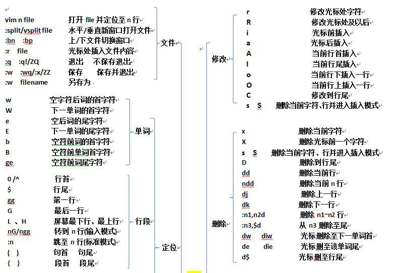
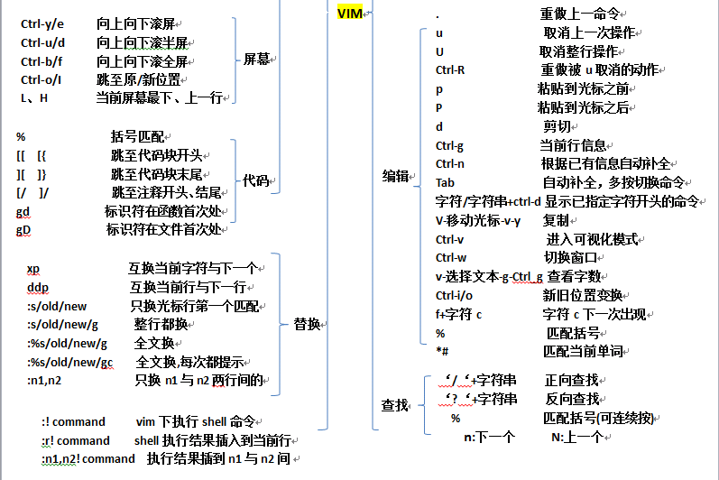

[配置](http://www.jianshu.com/p/923aec861af3)
zsh 选择Silver Aerogel
    * 偏好设置-描述文件-Silver Aerogel，然后设置成默认即可
##使用
####插件
* 使用Vundle
    * 将希望安装的插件写入call vundle#begin()和call vundle#end()行之间：Plugin '插件名'
    * 打开Vim编辑器，运行下面的命令：:PluginInstall
    * 在.vimrc中对插件进一步做详细配置
* NERDTree
    * 
    ```shell
F3：自定义启用/隐藏目录树
?: 快速帮助文档
o: 打开一个目录或者打开文件，创建的是buffer，也可以用来打开书签
go: 打开一个文件，但是光标仍然留在NERDTree，创建的是buffer
t: 打开一个文件，创建的是Tab，对书签同样生效
T: 打开一个文件，但是光标仍然留在NERDTree，创建的是Tab，对书签同样生效
i: 水平分割创建文件的窗口，创建的是buffer
gi: 水平分割创建文件的窗口，但是光标仍然留在NERDTree
s: 垂直分割创建文件的窗口，创建的是buffer
gs: 和gi，go类似
x: 收起当前打开的目录
X: 收起所有打开的目录
e: 以文件管理的方式打开选中的目录
D: 删除书签
P: 大写，跳转到当前根路径
p: 小写，跳转到光标所在的上一级路径
K: 跳转到第一个子路径
J: 跳转到最后一个子路径
<C-j>和<C-k>: 在同级目录和文件间移动，忽略子目录和子文件
C: 将根路径设置为光标所在的目录
u: 设置上级目录为根路径
U: 设置上级目录为跟路径，但是维持原来目录打开的状态
r: 刷新光标所在的目录
R: 刷新当前根路径
I: 显示或者不显示隐藏文件
f: 打开和关闭文件过滤器
q: 关闭NERDTree
A: 全屏显示NERDTree，或者关闭全屏
    ```
* 窗口跳转
```shell
:sv <filename>新文件会在当前文件下方界面打开打开;
:vs <filename>新文件会在当前文件右侧界面打开;
记得在输入完:sv后,利用tab补全功能，快速查找文件。
组合快捷键：- Ctrl-j 切换到下方的分割窗口
组合快捷键：- Ctrl-k 切换到上方的分割窗口
组合快捷键：- Ctrl-l 切换到右侧的分割窗口
组合快捷键：- Ctrl-h 切换到左侧的分割窗口
按空格键切换折叠
``` 
* ctags
```shell
ctags –R *     生成tags
通过热键+t（,+t）或者:TlistToggle弹出/关闭标签窗口
在标签窗口按F1可以打开以下帮助内容
o 在一个新打开的窗口中显示光标下tag
显示光标下tag的原型定义
u 更新taglist窗口中的tag
s 更改排序方式，在按名字排序和按出现顺序排序间切换
x taglist窗口放大和缩小，方便查看较长的tag
打开一个折叠，同zo
将tag折叠起来，同zc
打开所有的折叠，同zR
= 将所有tag折叠起来，同zM
[[ 跳到前一个文件
]] 跳到后一个文件
q 关闭taglist窗口
   ====
   "按下Ctrl+T重新生成tag文件，并更新taglist
map <C-T> :!ctags -R --c++-kinds=+p --fields=+iaS --extra=+q .<CR><CR> :TlistUpdate<CR>
set tags=tags
set tags+=./tags "add current directory's generated tags file
set tags+=~/.../tags "add new tags file(刚生成tags路径，不要移动否则ctrl+］，会提示找不到源码文件)
Ctrl＋］ 跳到当前光标下单词的标签
Ctrl＋O 返回上一个标签
Ctrl＋T 返回上一个标签
:tag TagName 跳到TagName标签
    以上命令是在当前窗口显示标签，当前窗口的文件替代为包标签的文件，当前窗口光标跳到标签位置。
    如果不希望在当前窗口显示标签，可以使用以下命令：
:stag TagName 新窗口显示TagName标签，光标跳到标签处
Ctrl＋W + ］ 新窗口显示当前光标下单词的标签，光标跳到标签处
    当一个标签有多个匹配项时（函数 (或类中的方法) 被多次定义），":tags"命令会跳转到第一处。如果在当前文件中存在匹配
    那它将会被首先使用.可以用这些命令在各匹配的标签间移动：
:tfirst 到第一个匹配
:[count]tprevious 向前 [count] 个匹配
:[count]tnext 向后 [count] 个匹配
:tlast 到最后一个匹配
    或者使用以下命令选择要跳转到哪一个
:tselect TagName
    输入以上命令后，vim会为你展示一个选择列表。然后你可以输入要跳转到的匹配代号 (在第一列)。其它列的信息可以让你知道
    标签在何处被定义过。以下命令将在预览窗口显示标签
:ptag TagName 预览窗口显示TagName标签，光标跳到标签处
Ctrl＋W + } 预览窗口显示当前光标下单词的标签，光标跳到标签处
:pclose 关闭预览窗口
:pedit file.h 在预览窗口中编辑文件file.h（在编辑头文件时很有用）
:psearch atoi 查找当前文件和任何包含文件中的单词并在预览窗口中显示匹配，在使    用没有标签文件的库函数时十分有用。
```
* 自动补全
    * 编辑文本时，自动弹出补全菜单，通过tab和shift+tab键上下切换选项，enter或空格进行选取。 
* 注释
    * 在normal模式下按v并移动光标选择需要注释的行，再按F4就可以为所有选中的行添加注释
* ctrip
    * ctrl+P 唤出。 ctrl+G推出
******
####vim自身




#######

[return](README.md)