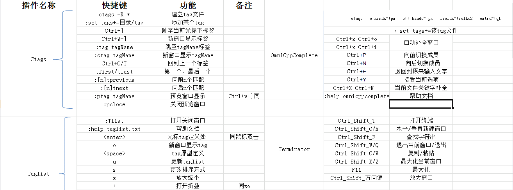

[iterm2](iterm2.md)
[macvim](mvim.md)
# Vim环境
VIM编码共涉及四个选项：encoding、fileencoding、fileencodings、termcoding；
    * encoding：vim内部编码格式；包括缓冲区、消息文本、菜单等
    * fileencoding：vim打开的 文件的编码格式。
    * fileencodings：vim在打开文件的时候逐一探测这个选项内值，如果探测成功，则赋值给fileencoding，从而打开文件；
    * termcoding：终端编码格式。一般不会用到；
    * encoding：vim内部编码格式；包括缓冲区、消息文本、菜单等

工作方式：
    * 使用.vimrc内encoding编码打开vim，设置缓冲区、消息文本等
    * 在打开文件的时候逐一探测编码集合，如果找到则赋值给fileencoding，打开文件。
所以unicode格式编码一般写在前面，latin格式写在后面。默认没有匹配用latin
    * 打开文件时对比fileencoding和encoding编码，如果不同则按照encoding编码格式转化文件内容，并放倒新的缓冲区中，然后可以编辑文件；
    * 保存文件时，如果fileencoding和encoding不同，按照fileencoding编码格式将缓冲区内容写入文件中；
 

### 1、安装Vim和Vim基本插件:

    sudo apt-get install vim vim-scripts vim-doc
    vim --version:显示vim版本及支持的功能与语言 
其中vim-scripts是vim的一些基本插件，包括语法高亮的支持、缩进等等。<br>
vim中文帮助文档tar包下载地址:
http://sourceforge.net/projects/vimcdoc/files/vimcdoc/<br>
解压后其中有个doc文件夹, 将其中的内容全部复制到~/.vim/doc, 或者vim安装目录下的doc目录中, 此时vim中的help信息已经是中文的了.<br>
* a. 
如果无法显示中文, 在~/.vimrc中增加下面这句试试:
    ```set helplang=cn```
* b. 
帮助文件的文本是utf-8编码的, 如果想用vim直接查看, 需要在~/.vimrc中设置:
     ```set encoding=utf-8```
<br>
[HELP_CN](http://vimcdoc.sourceforge.net/doc/help.html)

### 2、新建目录及文件

* 
~/.vim/plugin
* 
~/.vim/doc
* 
~/.vim/syntax
* 
~/.vimrc

windows和linux在配置上的不同：<br>
　　win中的C:\Program Files\Vim 目录对应linux上的~/.vim/<br>
　　win中的C:\Program Files\Vim\_vimrc对应linux上的~/.vimrc文件<br>
　　各种配置在.vimrc改就对了
### 3、配置文件：


```/usr/share/vim/ 和 /etc/vim/，我们不动。而在当前用户下新建文件： .vimrc```

**个性化:**当前用户下新建文件： .vimrc
```C
    "配置文件中，以单个双引号开头的文字为注释。
syntax enable
syntax on           " 语法高亮
set ignorecase      " 忽略大小写
set tabstop=4       " 设置制表符(tab键)的宽度
set cindent         " 使用 C/C++ 语言的自动缩进方式
set showmatch       " 设置匹配模式，显示匹配的括号
set number          " 显示行号
set history=50      " 历史记录50条

"--状态行设置--
set laststatus=2    " 总显示最后一个窗口的状态行
set ruler           " 标尺，用于显示光标位置的行号和列号

"--命令行设置--
set showcmd         " 命令行显示输入的命令
set showmode        " 命令行显示vim当前模式

"--find setting--
set incsearch       " 输入字符串就显示匹配点
set hlsearch        " 高亮匹配

"--中文乱码－－
let &termencoding=&encoding
set fileencodings=utf-8,gbk,utf-16,big5
```

### 4、插件安装
vim-easy-align 自动对其


1. 
**ctags**; 建立源码树的标签索引
    ```sudo apt-get install ctags```
```C
    与OmniCppComplete配合运作:  ctags -R --c++-kinds=+p --fields=+iaS --extra=+q .
1 进入到源码目录,输入命令: ctags -R * ，你会发现多了一个tags文件，这个就是索引文件
2 配置：
    注册索引文件tags的路径: set tags+=/.../tags
    vim ~/.vimrc
    "--ctags setting--
    "按下F5重新生成tag文件，并更新taglist
    map <F5> :!ctags -R --c++-kinds=+p --fields=+iaS --extra=+q .<CR><CR> :TlistUpdate<CR>
    imap <F5> <ESC>:!ctags -R --c++-kinds=+p --fields=+iaS --extra=+q .<CR><CR> :TlistUpdate<CR>
    set tags=tags
    set tags+=./tags        "add current directory's generated tags file
    set tags+=~/.../tags    "add new tags file(刚生成tags路径，不要移动否则ctrl+］，会提示找不到源码文件)
3 用法： 
    Ctrl＋］  跳到当前光标下单词的标签
    Ctrl＋O  返回上一个标签
    Ctrl＋T  返回上一个标签
    :tag TagName 跳到TagName标签
    以上命令是在当前窗口显示标签，当前窗口的文件替代为包标签的文件，当前窗口光标跳到标签位置。
    如果不希望在当前窗口显示标签，可以使用以下命令：
    :stag TagName 新窗口显示TagName标签，光标跳到标签处
    Ctrl＋W + ］  新窗口显示当前光标下单词的标签，光标跳到标签处
    当一个标签有多个匹配项时（函数 (或类中的方法) 被多次定义），":tags"命令会跳转到第一处。如果在当前文件中存在匹配
    那它将会被首先使用.可以用这些命令在各匹配的标签间移动：
    :tfirst    到第一个匹配
    :[count]tprevious 向前 [count] 个匹配
    :[count]tnext  向后 [count] 个匹配
    :tlast    到最后一个匹配
    或者使用以下命令选择要跳转到哪一个
    :tselect TagName
    输入以上命令后，vim会为你展示一个选择列表。然后你可以输入要跳转到的匹配代号 (在第一列)。其它列的信息可以让你知道
    标签在何处被定义过。以下命令将在预览窗口显示标签
    :ptag TagName 预览窗口显示TagName标签，光标跳到标签处
    Ctrl＋W + }  预览窗口显示当前光标下单词的标签，光标跳到标签处
    :pclose   关闭预览窗口
    :pedit file.h 在预览窗口中编辑文件file.h（在编辑头文件时很有用）
    :psearch atoi 查找当前文件和任何包含文件中的单词并在预览窗口中显示匹配，在使用没有标签文件的库函数时十分有用。
    ```
1. 
**vim-addons**:管理vim插件 ```sudo apt-get install vim-addon-manager```
    ```vim-addons status```
1. 
**OmniCppComplete:**自动补全 ```vim-addons install omnicppcomplete```
```C
配置：
    "-- omnicppcomplete setting --
    " 按下F3自动补全代码，注意该映射语句后不能有其他字符，包括tab；否则按下F3会自动补全一些乱码
    imap <F3> <C-X><C-O>
    " 按下F2根据头文件内关键字补全
    imap <F2> <C-X><C-I>
    set completeopt=menu,menuone        " 关掉智能补全时的预览窗口
    let OmniCpp_MayCompleteDot = 1      " autocomplete with .
    let OmniCpp_MayCompleteArrow = 1    " autocomplete with ->
    let OmniCpp_MayCompleteScope = 1    " autocomplete with ::
    let OmniCpp_SelectFirstItem = 2     " select first item (but don't insert)
    let OmniCpp_NamespaceSearch = 2     " search namespaces in this and included files
    let OmniCpp_ShowPrototypeInAbbr = 1 " show function prototype in popup window
    let OmniCpp_GlobalScopeSearch=1     " enable the global scope search
    let OmniCpp_DisplayMode=1           " Class scope completion mode: always show all members
    "let OmniCpp_DefaultNamespaces=["std"]
    let OmniCpp_ShowScopeInAbbr=1       " show scope in abbreviation and remove the last column
    let OmniCpp_ShowAccess=1
快捷键:
    Ctrl+P  向前切换成员
    Ctrl+N  向后切换成员
    Ctrl+E  表示退出下拉窗口, 并退回到原来录入的文字
    Ctrl+Y  表示退出下拉窗口, 并接受当前选项
    其他补全方式:
    Ctrl+X Ctrl+L 整行补全
    Ctrl+X Ctrl+N  根据当前文件里关键字补全
    Ctrl+X Ctrl+K  根据字典补全
    Ctrl+X Ctrl+T  根据同义词字典补全
    Ctrl+X Ctrl+I  根据头文件内关键字补全
    Ctrl+X Ctrl+]  根据标签补全
    Ctrl+X Ctrl+F  补全文件名
    Ctrl+X Ctrl+D  补全宏定义
    Ctrl+X Ctrl+V  补全vim命令
    Ctrl+X Ctrl+U  用户自定义补全方式
    Ctrl+X Ctrl+S  拼写建议
    Ctrl+X Ctrl+O  弹出补全窗口
    帮助文档
    :help omnicppcomplete
```
1. 
**echofunc:**提示函数原型
```C
下载地址：http://www.vim.org/scripts/script.php?script_id=1735
下载完成后，把echofunc.vim文件放到 ~/.vim/plugin文件夹中
函数名后输入一个"("的时候,通过按键"Alt+-"和"Alt+="向前和向后翻页```
1. 
**Taglist:**标签浏览器  ``` vim-addons install taglist```
```C
配置：
    "-- Taglist setting --
    let Tlist_Ctags_Cmd='ctags' "因为我们放在环境变量里，所以可以直接执行
    let Tlist_Use_Right_Window=1 "让窗口显示在右边，0的话就是显示在左边
    let Tlist_Show_One_File=0 "让taglist可以同时展示多个文件的函数列表
    let Tlist_File_Fold_Auto_Close=1 "非当前文件，函数列表折叠隐藏
    let Tlist_Exit_OnlyWindow=1 "当taglist是最后一个分割窗口时，自动推出vim
    "是否一直处理tags.1:处理;0:不处理
    let Tlist_Process_File_Always=1 "实时更新tags
    let Tlist_Inc_Winwidth=0
快捷键:
    ":Tlist"打开/关闭taglist窗口
帮助文档
    :help taglist.txt
```
1. 
**WinManager**;文件浏览器和缓冲区管理器```vim-addons install winmanager```
```C
配置：
"-- WinManager setting --
    let g:winManagerWindowLayout='FileExplorer|TagList' " 设置我们要管理的插件
    "let g:persistentBehaviour=0 " 如果所有编辑文件都关闭了，退出vim
    nmap wm :WMToggle<cr>
常用命令
    :WMToggle 打开/关闭WinManage,(直接按wm就可以打开/关闭WinManage)
    文件浏览器命令（在文件浏览器窗口中使用）
    <enter>或双击  如果光标下是目录, 则进入该目录; 如果光标下文件, 则打开该文件
    <tab>   如果光标下是目录, 则进入该目录; 如果光标下文件, 则在新窗口打开该文件
    <F5> 刷新列表
    -  返回上一层目录
    c  使浏览目录成为vim当前工作目录
    d  创建目录
    D  删除当前光标下的目录或文件
    i  切换显示方式
    R  文件或目录重命名
    s  选择排序方式
    r  反向排序列表
    x  定制浏览方式, 使用你指定的程序打开该文件
winmanager帮助文档
    :help winmanager
netrw帮助文档
    :help netrw
```
1. 
**MiniBufferExplorer**:buffer管理器```vim-addons install minibufexplorer```
```C
配置：
    " -- MiniBufferExplorer --
    let g:miniBufExplMapWindowNavVim = 1 " 按下Ctrl+h/j/k/l，可以切换到当前窗口的上下左右窗口
    let g:miniBufExplMapWindowNavArrows = 1 " 按下Ctrl+箭头，可以切换到当前窗口的上下左右窗口
    let g:miniBufExplMapCTabSwitchBufs = 1 
        " 启用以下两个功能：Ctrl+tab移到下一个buffer并在当前窗口打开；Ctrl+Shift+tab移到上一个buffer并
        "在当前窗口打开；ubuntu好像不支持
    let g:miniBufExplModSelTarget = 1 " 不要在不可编辑内容的窗口（如TagList窗口）中打开选中的buffer
常用命令:
    <Tab>  移到上一个buffer
    <Shift-Tab> 移到下一个buffer
    <Enter>  打开光标所在的buffer
    d   删除光标所在的buffer```
1. 
**代码折叠fold**
```C
常用命令
    za  打开/关闭在光标下的折叠
    zA  循环地打开/关闭光标下的折叠
    zo  打开 (open) 在光标下的折叠
    zO  循环打开 (Open) 光标下的折叠
    zc  关闭 (close) 在光标下的折叠
    zC  循环关闭 (Close) 在光标下的所有折叠
    zM  关闭所有折叠
    zR  打开所有的折叠```
1. 
**Project**:项目目录数管理器```vim-addons install project```
```C
Project目录树可以通过下面的步骤生成：
1） 打开vim在命令模式下输入 :Project，在屏幕的最左边就会出现一个project框。不过因为没有初始化暂时是空的
2）在命令模式下（不是插入模式）输入\C （大写的C），会出现下面这些信息：
Enter the Name of the Entry: xxxx （输入项目名称）
Enter the Absolute Directory to Load: /xxx/xxx/xxx （输入项目根目录的绝对路径）
Enter the CD parameter: . （“.”为当前目录）或者和项目根目录一致
Enter the File Filter: *.* （符合条件的源文件，可以是*.cpp/*.h等）
PS：项目目录可以嵌套。而且更改之后在~/.vimprojects文件中就能看到内容，你可以手动进行更改。```
1. 
**quickfix**:出错位置
```C
配置：
    "-- QuickFix setting --
    " 按下F6，执行make clean
    map <F6> :make clean<CR><CR><CR>
    " 按下F7，执行make编译程序，并打开quickfix窗口，显示编译信息
    map <F7> :make<CR><CR><CR> :copen<CR><CR>
    " 按下F8，光标移到上一个错误所在的行
    map <F8> :cp<CR>
    " 按下F9，光标移到下一个错误所在的行
    map <F9> :cn<CR>
    " 以上的映射是使上面的快捷键在插入模式下也能用
    imap <F6> <ESC>:make clean<CR><CR><CR>
    imap <F7> <ESC>:make<CR><CR><CR> :copen<CR><CR>
    imap <F8> <ESC>:cp<CR>
    imap <F9> <ESC>:cn<CR>
帮助文档
    :help usr_30
    :help quickfix
下面的命令运行 "make" (包括你所给出的参数) 程序并捕捉其运行结果: >
 :make {arguments}
        如果编译时出现错误，按 <Enter>，回到vim界面，看不到出错信息了！这时，可以运行以下命令
:cw[indow]
        打开quickfix窗口来查看出错信息，它会自动跳到第一处出错的地方。然后，你可以双击出错某一条出错信
        息vim就会自动跳转到相应的出错位置
:cn[ext]  光标移到下一个错误所在的行
:cp[revious] 光标移到上一个错误所在的行
:cfirst  到第一处错误
:clast  到最后一处错误
:cc   空间不够时，Vim 会缩短出错信息。如果你想查看详细信息，可以使用此命令
:cl[ist] 列出所有出错信息的概览（只有那些含有文件名或行数的错误信息会被显示，
            需要查看那些并不含文件名或行数的信息可用“:cl[ist]!”命令）```
1. 
**Cscope**:类ctags```sudo apt-get install cscope```
```C
配置：
    "-- Cscope setting --
    if has("cscope")
    set csprg=/usr/bin/cscope " 指定用来执行cscope的命令
    set csto=0 " 设置cstag命令查找次序：0先找cscope数据库再找标签文件；1先找标签文件再找cscope数据库
    set cst " 同时搜索cscope数据库和标签文件
    set cscopequickfix=s-,c-,d-,i-,t-,e- " 使用QuickFix窗口来显示cscope查找结果
    set nocsverb
    if filereadable("cscope.out") " 若当前目录下存在cscope数据库，添加该数据库到vim
    cs add cscope.out
    elseif $CSCOPE_DB != "" " 否则只要环境变量CSCOPE_DB不为空，则添加其指定的数据库到vim
    cs add $CSCOPE_DB
    endif
    set csverb
    endif
    map <F4> :cs add ./cscope.out .<CR><CR><CR> :cs reset<CR>
    imap <F4> <ESC>:cs add ./cscope.out .<CR><CR><CR> :cs reset<CR>
    " 将:cs find c等Cscope查找命令映射为<C-_>c等快捷键（按法是先按Ctrl+Shift+-, 然后很快再按下c）
    nmap <C-_>s :cs find s <C-R>=expand("<cword>")<CR><CR> :copen<CR><CR>
    nmap <C-_>g :cs find g <C-R>=expand("<cword>")<CR><CR>
    nmap <C-_>d :cs find d <C-R>=expand("<cword>")<CR><CR> :copen<CR><CR>
    nmap <C-_>c :cs find c <C-R>=expand("<cword>")<CR><CR> :copen<CR><CR>
    nmap <C-_>t :cs find t <C-R>=expand("<cword>")<CR><CR> :copen<CR><CR>
    nmap <C-_>e :cs find e <C-R>=expand("<cword>")<CR><CR> :copen<CR><CR>
    nmap <C-_>f :cs find f <C-R>=expand("<cfile>")<CR><CR>
    nmap <C-_>i :cs find i <C-R>=expand("<cfile>")<CR><CR> :copen<CR><CR>
cscope的主要功能是通过其"find"子命令来实现的
    "cscope find"的用法:
    cs find c|d|e|f|g|i|s|t name
    0 或 s  查找这个 C 符号(可以跳过注释)
    1 或 g  查找这个定义
    2 或 d  查找这个函数调用的函数
    3 或 c  查找调用过这个函数的函数
    4 或 t  查找这个字符串
    6 或 e  查找这个 egrep 模式
    7 或 f  查找这个文件
    8 或 i  查找包含这个文件的文件
用法：
    <1>、为源码建立一个cscope数据库
    lingd@ubuntu:~/arm/linux-2.6.28.7$ cscope -Rbq
    lingd@ubuntu:~/arm/linux-2.6.28.7$ ls cscope.*
    cscope.in.out  cscope.out  cscope.po.out
    <2>、用vim打开某个源码文件，末行模式下，输入“:cs add cscope.out"（该命令已被我们映射为快捷键F4），
        添加cscope数据库到vim。因为我们已将vim配置为启动时，自动添加当前目录下的cscope数据库，
        所以你再添加该cscope数据库时，vim会提示“重复cscope数据库 未被加入“
    <3>、完成前两步后，现在就可以用“cs find c”等Cscope查找命令查找关键字了。我们已在.vimrc中将“cs find c”等
        Cscope查找命令映射为<C-_>c等快捷键（按法是先按Ctrl+Shift+-, 然后很快按下c）
帮助文档
    :help if_cscop
    注意：帮助文档if_cscop中，快捷键映射nmap <C-_>i :cs find i ^<C-R>=expand("<cfile>")<CR>$<CR>是有误的
        比如光标“header.h”上按下<C-_>i，也就是查找包含“header.h“的文件。但是按照这个映射规则，则是将<C-_>i映射
        为cs find i^header.h$，也就是查找包含“^header.h$“的文件，这显然不是我们想要的结果。该映射规则应该
        改成nmap <C-_>i :cs find i <C-R>=expand("<cfile>")<CR><CR>```
**12 python支持**
[下载](http://www.vim.org/scripts/script.php?script_id=790)

```C
set filetype=python
au BufNewFile,BufRead *.py,*.pyw setf python


```
## 一键运行C／C++(跨平台)
```C++
"把以下代码放到： .vimrc
"------------------------------------------------------------------------------
"  < 判断操作系统是否是 Windows 还是 Linux >
"------------------------------------------------------------------------------
if(has("win32") || has("win64") || has("win95") || has("win16"))
    let g:iswindows = 1
else
    let g:iswindows = 0
endif
 
"------------------------------------------------------------------------------
"  < 判断是终端还是 Gvim >
"------------------------------------------------------------------------------
if has("gui_running")
    let g:isGUI = 1
else
    let g:isGUI = 0
endif
 
"------------------------------------------------------------------------------
"  < 编译、连接、运行配置 >
"------------------------------------------------------------------------------
" F9 一键保存、编译、连接存并运行
map <F9> :call Run()<CR>
imap <F9> <ESC>:call Run()<CR>
 
" Ctrl + F9 一键保存并编译
map <c-F9> :call Compile()<CR>
imap <c-F9> <ESC>:call Compile()<CR>
 
" Ctrl + F10 一键保存并连接
map <c-F10> :call Link()<CR>
imap <c-F10> <ESC>:call Link()<CR>
 
let s:LastShellReturn_C = 0
let s:LastShellReturn_L = 0
let s:ShowWarning = 1
let s:Obj_Extension = '.o'
let s:Exe_Extension = '.exe'
let s:Sou_Error = 0
 
let s:windows_CFlags = 'gcc\ -fexec-charset=gbk\ -Wall\ -g\ -O0\ -c\ %\ -o\ %<.o'
let s:linux_CFlags = 'gcc\ -Wall\ -g\ -O0\ -c\ %\ -o\ %<.o'
 
let s:windows_CPPFlags = 'g++\ -fexec-charset=gbk\ -Wall\ -g\ -O0\ -c\ %\ -o\ %<.o'
let s:linux_CPPFlags = 'g++\ -Wall\ -g\ -O0\ -c\ %\ -o\ %<.o'
 
func! Compile()
    exe ":ccl"
    exe ":update"
    if expand("%:e") == "c" || expand("%:e") == "cpp" || expand("%:e") == "cxx"
        let s:Sou_Error = 0
        let s:LastShellReturn_C = 0
        let Sou = expand("%:p")
        let Obj = expand("%:p:r").s:Obj_Extension
        let Obj_Name = expand("%:p:t:r").s:Obj_Extension
        let v:statusmsg = ''
        if !filereadable(Obj) || (filereadable(Obj) && (getftime(Obj) < getftime(Sou)))
            redraw!
            if expand("%:e") == "c"
                if g:iswindows
                    exe ":setlocal makeprg=".s:windows_CFlags
                else
                    exe ":setlocal makeprg=".s:linux_CFlags
                endif
                echohl WarningMsg | echo " compiling..."
                silent make
            elseif expand("%:e") == "cpp" || expand("%:e") == "cxx"
                if g:iswindows
                    exe ":setlocal makeprg=".s:windows_CPPFlags
                else
                    exe ":setlocal makeprg=".s:linux_CPPFlags
                endif
                echohl WarningMsg | echo " compiling..."
                silent make
            endif
            redraw!
            if v:shell_error != 0
                let s:LastShellReturn_C = v:shell_error
            endif
            if g:iswindows
                if s:LastShellReturn_C != 0
                    exe ":bo cope"
                    echohl WarningMsg | echo " compilation failed"
                else
                    if s:ShowWarning
                        exe ":bo cw"
                    endif
                    echohl WarningMsg | echo " compilation successful"
                endif
            else
                if empty(v:statusmsg)
                    echohl WarningMsg | echo " compilation successful"
                else
                    exe ":bo cope"
                endif
            endif
        else
            echohl WarningMsg | echo ""Obj_Name"is up to date"
        endif
    else
        let s:Sou_Error = 1
        echohl WarningMsg | echo " please choose the correct source file"
    endif
    exe ":setlocal makeprg=make"
endfunc
 
func! Link()
    call Compile()
    if s:Sou_Error || s:LastShellReturn_C != 0
        return
    endif
    let s:LastShellReturn_L = 0
    let Sou = expand("%:p")
    let Obj = expand("%:p:r").s:Obj_Extension
    if g:iswindows
        let Exe = expand("%:p:r").s:Exe_Extension
        let Exe_Name = expand("%:p:t:r").s:Exe_Extension
    else
        let Exe = expand("%:p:r")
        let Exe_Name = expand("%:p:t:r")
    endif
    let v:statusmsg = ''
    if filereadable(Obj) && (getftime(Obj) >= getftime(Sou))
        redraw!
        if !executable(Exe) || (executable(Exe) && getftime(Exe) < getftime(Obj))
            if expand("%:e") == "c"
                setlocal makeprg=gcc\ -o\ %<\ %<.o
                echohl WarningMsg | echo " linking..."
                silent make
            elseif expand("%:e") == "cpp" || expand("%:e") == "cxx"
                setlocal makeprg=g++\ -o\ %<\ %<.o
                echohl WarningMsg | echo " linking..."
                silent make
            endif
            redraw!
            if v:shell_error != 0
                let s:LastShellReturn_L = v:shell_error
            endif
            if g:iswindows
                if s:LastShellReturn_L != 0
                    exe ":bo cope"
                    echohl WarningMsg | echo " linking failed"
                else
                    if s:ShowWarning
                        exe ":bo cw"
                    endif
                    echohl WarningMsg | echo " linking successful"
                endif
            else
                if empty(v:statusmsg)
                    echohl WarningMsg | echo " linking successful"
                else
                    exe ":bo cope"
                endif
            endif
        else
            echohl WarningMsg | echo ""Exe_Name"is up to date"
        endif
    endif
    setlocal makeprg=make
endfunc
 
func! Run()
    let s:ShowWarning = 0
    call Link()
    let s:ShowWarning = 1
    if s:Sou_Error || s:LastShellReturn_C != 0 || s:LastShellReturn_L != 0
        return
    endif
    let Sou = expand("%:p")
    let Obj = expand("%:p:r").s:Obj_Extension
    if g:iswindows
        let Exe = expand("%:p:r").s:Exe_Extension
    else
        let Exe = expand("%:p:r")
    endif
    if executable(Exe) && getftime(Exe) >= getftime(Obj) && getftime(Obj) >= getftime(Sou)
        redraw!
        echohl WarningMsg | echo " running..."
        if g:iswindows
            exe ":!%<.exe"
        else
            if g:isGUI
                exe ":!gnome-terminal -e ./%<"
            else
                exe ":!./%<"
            endif
        endif
        redraw!
        echohl WarningMsg | echo " running finish"
    endif
endfunc```

###文件头自动生成
```C
""""""""""""""""""""""""""""""""""""""""""""""""""""""""""""""""""""""""""新文件标题
"""""""""""""""""""""""""""""""""""""""""""""""""""""""""""""""""""""""
"新建.c,.h,.sh,.java文件，自动插入文件头 
autocmd BufNewFile *.cpp,*.[ch],*.sh,*.java exec ":call SetTitle()" 
""定义函数SetTitle，自动插入文件头 
func SetTitle() 
    "如果文件类型为.sh文件 
    if &filetype == 'sh' 
        call setline(1,"\#########################################################################") 
        call append(line("."), "\# File Name: ".expand("%")) 
        call append(line(".")+1, "\# CopyRights(c) Leo zhang")
        call append(line(".")+2, "\# All Rights Reserved") 
        call append(line(".")+3, "\# Description: ") 
        call append(line(".")+4, "\# Author: Leo zhang") 
        call append(line(".")+5, "\# mail: zhangzhuang24@163.com") 
        call append(line(".")+6, "\# Created Time: ".strftime("%D")) 
        call append(line(".")+7, "\#########################################################################") 
        call append(line(".")+8, "\#!/bin/bash") 
        call append(line(".")+9, "") 
    else 
        call setline(1,"/*########################################################################") 
        call append(line("."), "* File Name: ".expand("%")) 
        call append(line(".")+1, "* CopyRights(c) Leo zhang")
        call append(line(".")+2, "* All Rights Reserved") 
        call append(line(".")+3, "* Description: ") 
        call append(line(".")+4, "* Author: Leo zhang") 
        call append(line(".")+5, "* mail: zhangzhuang24@163.com") 
        call append(line(".")+6, "* Created Time: ".strftime("%D")) 
        call append(line(".")+7, "*########################################################################*/") 
        call append(line(".")+8, " ")
    endif
    if &filetype == 'cpp'
        call append(line(".")+9, "#include<iostream>")
        call append(line(".")+10, "using namespace std;")
        call append(line(".")+11, "")
        call append(line(".")+12, "int main()")
        call append(line(".")+13, "{")
        call append(line(".")+14, " ")
        call append(line(".")+15, "return 0")
        call append(line(".")+16, "}")
        call append(line(".")+17, "")
    endif
    if &filetype == 'c'
        call append(line(".")+9, "#include<stdio.h>")
        call append(line(".")+10, "")
        call append(line(".")+11, "")
        call append(line(".")+12, "int main()")
        call append(line(".")+13, "{")
        call append(line(".")+14, " ")
        call append(line(".")+15, "return 0")
        call append(line(".")+16, "}")
        call append(line(".")+17, "")
    endif
    "新建文件后，自动定位到文件末尾
    autocmd BufNewFile * normal G
endfunc 
```

### Vim快捷键：


### Vim插件快捷键





[返回目录](README.md)