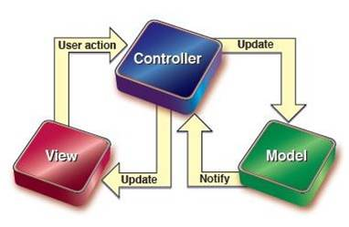
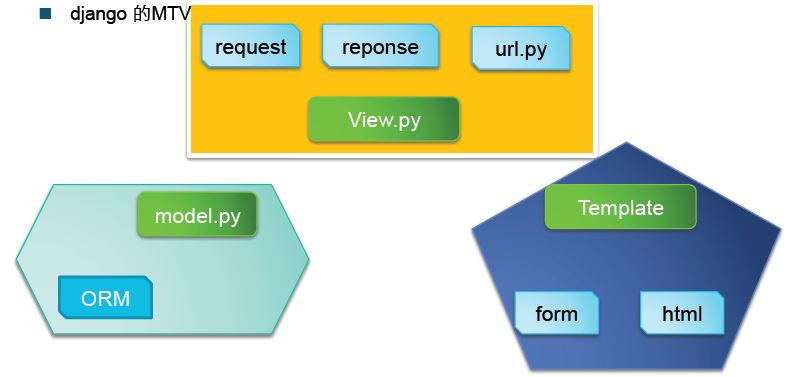

###简介Django的MTV模式
介绍之前，我们先说下Web开发中注明的**MVC模式**：
* 
M即Model模型层，主要负责数据相关的操作，比如定义数据库表及字段（由业务对象映射而来）、验证数据有效性、读取或更新数据库等；
* 
V即View视图层，主要负责怎么显示的问题，与用户的交互；
* 
C即Control控制层，主要负责根据用户的输入，与模型层和视图层交互实现具体的逻辑，然后显示给用户；

MVC模式主要是提供耦合式的连接方式：**数据存取逻辑、业务逻辑、表现逻辑**

而Django中做了一点改变，采用了**MTV模式**：
* 
M即Model模型层，还是业务对象对数据模型的映射，负责验证数据的有效性、读写数据库；
* 
T即Template模版层，负责与用户交互
* 
V即View视图层，负责实现业务逻辑，与Model与Template合作实现用户的请求；
* 
在Django中，请求不同的URL是通过一个叫做URL分发器的单元实现的，它可以把一个请求分发给不同的view处理，然后view负责与model、template交互完成具体的请求。这个URL分发器使用正则表达式来匹配不同的URL然后交给对应的view。

综上可见，Django中MVC模式与普通的web开发有所不同，普通web开发如Ruby on Rails中，视图负责的是如何显示数据，而在Django中，MVC的解释有所不同，视图不再是负责如何展示数据，而是要控制展示那些数据。
* 
普通：视图负责**如何展示数据**（表现逻辑），至于展示那些由C控制
* 
Django：视图负责**展示那些数据**（业务逻辑），如何展示由T控制
* 
普通的M层和Django中一样，但是C层由Django中的View层和URL分发器共同完成，V层由Template实现；

在Django中，一个请求过程：
* 
用户发出一个请求，浏览器将对应的URL发送给服务器；
* 
由服务器端URL分发器分发给对应的view处理逻辑；
* 
在view处理中，调用model读写数据库，处理结束后，调用Template将响应反馈给用户
* 
然后Web服务器将响应反馈给客户端；

Django评价：
* 
优点
    * 完善的后台管理：admin interface contrib
    * 自带的ORM与数据库的连接、更新（对象关系映射Object Relational Mapping，简称ORM）.
    * URL分发器
    * 错误页面中有详细的提示
    * APP概念：每个功能模块都视作一个APP，可插拔（增删）。
* 
不足
    * 
自带的ORM，不支持Python公认的SQLAlchemy标准

[返回目录](README.md)